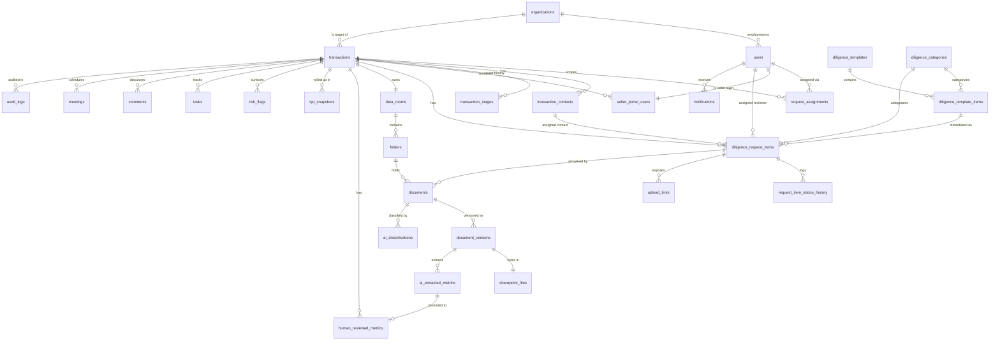

# 03 — Database Schema

**Platform:** Healthcare Mergers & Acquisitions Diligence Workflow Platform
**Audience:** Engineering, Data/Platform, Security/Compliance
**Status:** Implementation-grade specification
**Database:** Supabase Postgres 15+
**Last reviewed:** 2026-06-26

---

## 1. Purpose & Scope

This document is the authoritative source of truth for the **relational data model**. It defines every table, its purpose, key columns and Postgres types, primary/foreign key relationships, enumerated types, and indexes. It also specifies the **Row Level Security (RLS)** strategy that makes the data model safe for the external Seller, and the **append-only audit/logging** model that makes the platform defensible in a regulated healthcare M&A context.

The data model is grounded in three non-negotiable invariants that recur throughout this document:

1. **Document metadata lives in Postgres; document bytes live in SharePoint.** The DB is the index, workflow engine, and access-control authority. SharePoint (via Microsoft Graph) is the byte store and system of record for the file itself. We never duplicate file content into the database.
2. **We never store plaintext passwords or seller credentials.** Application user authentication is delegated to Supabase Auth / Microsoft Entra ID (no password column exists in our schema). The sensitive **Category A — Logins/Passwords** diligence workflow stores only *references* to secrets held in a dedicated secrets vault (Azure Key Vault), plus envelope-encrypted ciphertext — never plaintext, never reversible at the DB layer alone.
3. **AI-extracted data and human-reviewed data are separate, never co-mingled.** Machine output carries provenance, a confidence score, and a model fingerprint. A human-accepted value is a distinct, attributed record. The UI may show both; the system always knows which is which.

### 1.1 Conventions

| Convention | Rule |
|------------|------|
| Schema | Application tables in `public`. Auth identities in `auth` (managed by Supabase). |
| Primary keys | `uuid` default `gen_random_uuid()`, column name `id`, except `audit_logs`/`permission_logs` which use `bigint GENERATED ALWAYS AS IDENTITY` for append-only ordering. |
| Naming | `snake_case`, plural table names, `*_id` foreign keys, `*_at` for timestamps. |
| Timestamps | `timestamptz`, always UTC. Every table carries `created_at`; mutable tables carry `updated_at` (maintained by trigger). |
| Soft delete | `deleted_at timestamptz NULL` on user-facing content tables (documents, comments, diligence items). Hard delete reserved for GDPR/right-to-erasure runbooks only. |
| Tenancy/scoping | Almost everything is scoped to a `transaction_id`. The `transaction_id` is the unit of RLS isolation. |
| Money | `numeric(18,2)` for currency, never `float`. Percentages `numeric(7,4)`. |
| JSON | `jsonb` for semi-structured payloads (AI raw output, sync deltas, notification context). |
| Enums | Native Postgres `enum` types for closed, stable domains; lookup tables for domains that admins extend at runtime (e.g., diligence categories/templates). |

---

## 2. Enumerated Types

Closed, code-governed domains are modeled as native Postgres enums. Admin-extensible domains (categories, template items) are **lookup tables**, not enums, because they change without a deploy.

```sql
-- Application roles (mirrors the Roles & Permissions doc)
CREATE TYPE app_role AS ENUM (
  'admin', 'coordinator', 'executive',
  'finance_reviewer', 'operations_reviewer',
  'legal_reviewer', 'hr_reviewer', 'seller'
);

-- Lifecycle stage of a transaction (deal pipeline)
CREATE TYPE transaction_stage AS ENUM (
  'sourcing',            -- candidate identified, NDA pending
  'nda_executed',        -- NDA signed, portal not yet open
  'pre_signing_diligence', -- active pre-signing diligence
  'loi_negotiation',     -- letter of intent / term sheet
  'signed',              -- definitive agreement signed
  'post_signing_diligence', -- post-signing diligence & transition prep
  'closing',             -- closing conditions / funds flow
  'closed_won',          -- consummated
  'closed_lost',         -- abandoned / walked
  'on_hold'              -- paused
);

-- Seller-facing diligence REQUEST status (what the seller sees/sets)
CREATE TYPE diligence_status AS ENUM (
  'received',        -- seller has provided the item
  'pending',         -- requested, awaiting seller
  'not_applicable',  -- seller/internal marks N/A
  'denied'           -- seller declines / refuses to provide
);

-- INTERNAL review status (what reviewers drive; never shown raw to seller)
CREATE TYPE internal_review_status AS ENUM (
  'uploaded',                 -- document(s) attached, not yet triaged
  'under_review',             -- a reviewer is actively assessing
  'accepted',                 -- satisfies the requirement
  'rejected',                 -- does not satisfy; resubmission needed
  'needs_clarification',      -- reviewer has a question for the seller
  'overdue',                  -- past due date, still open
  'internal_review_complete'  -- terminal: review closed for this item
);

-- Whether an item is required before or after signing
CREATE TYPE needed_timeline AS ENUM (
  'pre_signing',
  'post_signing'
);

-- Risk severity for risk_flags
CREATE TYPE risk_level AS ENUM (
  'informational',
  'low',
  'medium',
  'high',
  'critical'
);

-- Aggregate deal-health bucket (derived KPI; persisted on snapshots)
CREATE TYPE deal_health_score AS ENUM (
  'on_track',     -- green
  'minor_issues', -- yellow
  'at_risk',      -- orange
  'critical',     -- red
  'stalled'       -- no movement / blocked
);

-- Supporting enums used across operational tables
CREATE TYPE contact_type        AS ENUM ('primary', 'finance', 'legal', 'hr', 'clinical', 'it', 'broker', 'other');
CREATE TYPE provenance_source   AS ENUM ('ai_extracted', 'human_entered', 'human_reviewed', 'imported');
CREATE TYPE document_source     AS ENUM ('seller_upload', 'internal_upload', 'sharepoint_import', 'email_attachment');
CREATE TYPE task_status         AS ENUM ('open', 'in_progress', 'blocked', 'done', 'cancelled');
CREATE TYPE task_priority       AS ENUM ('low', 'normal', 'high', 'urgent');
CREATE TYPE notification_channel AS ENUM ('in_app', 'email', 'teams');
CREATE TYPE reminder_cadence    AS ENUM ('once', 'daily', 'weekly', 'custom_cron');
CREATE TYPE sync_status         AS ENUM ('success', 'partial', 'failed', 'skipped');
CREATE TYPE meeting_kind        AS ENUM ('intro', 'diligence_review', 'management_presentation', 'site_visit', 'closing', 'internal');
CREATE TYPE audit_action        AS ENUM ('create', 'read', 'update', 'delete', 'login', 'logout', 'export', 'reveal_credential', 'sync', 'permission_change');
```

> **Enum evolution.** Enum labels are append-only in practice; we never `RENAME`/`DELETE` labels in place. New labels are added with `ALTER TYPE ... ADD VALUE`. Removing a stage requires a data migration to a successor label first.

---

## 3. Identity, Roles & Organizations

### 3.1 `users` (profiles)

Application profile for every human actor. Authentication is **delegated** — there is no password column here. `id` is the foreign key to `auth.users.id` (Supabase Auth), which itself federates Microsoft Entra ID for internal staff and email OTP/magic link for sellers.

| Column | Type | Notes |
|--------|------|-------|
| `id` | `uuid` PK | = `auth.users.id` (FK, on delete cascade) |
| `email` | `citext` NOT NULL UNIQUE | canonical login email |
| `display_name` | `text` NOT NULL | |
| `global_role` | `app_role` NOT NULL | the role carried everywhere (see Roles doc) |
| `organization_id` | `uuid` FK → `organizations.id` | the acquiring org for internal users; seller's practice for sellers |
| `entra_object_id` | `uuid` NULL UNIQUE | Entra ID object id for internal SSO users |
| `is_external` | `boolean` NOT NULL DEFAULT false | true ⇒ seller-class account |
| `mfa_enrolled` | `boolean` NOT NULL DEFAULT false | |
| `last_seen_at` | `timestamptz` NULL | |
| `status` | `text` NOT NULL DEFAULT 'active' | `active` / `suspended` / `deprovisioned` |
| `created_at` / `updated_at` | `timestamptz` | |

- **PK:** `id`. **FK:** `id → auth.users(id)`, `organization_id → organizations(id)`.
- **Indexes:** `UNIQUE(email)`, `UNIQUE(entra_object_id)`, `idx_users_org (organization_id)`, partial `idx_users_external (id) WHERE is_external`.

> **No credentials here.** Password hashes, OTP secrets, and refresh tokens are owned by Supabase Auth (`auth.users`), not by us. We store identity metadata only.

### 3.2 `roles`

Catalog of role definitions and their default permission keys. The `app_role` enum is the closed set of role *keys*; this table holds the human metadata + default grant bundle (used to seed `request_assignments` and UI). Kept as a table (not just the enum) so Admin can adjust default permission bundles without a deploy.

| Column | Type | Notes |
|--------|------|-------|
| `role` | `app_role` PK | |
| `label` | `text` NOT NULL | |
| `trust_tier` | `smallint` NOT NULL | 0=platform … 3=untrusted external |
| `default_permission_keys` | `text[]` NOT NULL | permission-key vocabulary from Roles doc |
| `is_external` | `boolean` NOT NULL | |

### 3.3 `organizations`

Both the acquiring company (singleton, `kind='acquirer'`) and each seller practice (`kind='target'`). One target org per transaction.

| Column | Type | Notes |
|--------|------|-------|
| `id` | `uuid` PK | |
| `name` | `text` NOT NULL | |
| `kind` | `text` NOT NULL | `acquirer` / `target` |
| `npi` | `text` NULL | National Provider Identifier (group) |
| `tax_id_last4` | `text` NULL | never store full EIN/TIN |
| `practice_type` | `text` NULL | primary_care / specialty / rhc / physician_group / multi_location |
| `state` | `text` NULL | |
| `created_at` / `updated_at` | `timestamptz` | |

- **Indexes:** `idx_org_kind (kind)`, `idx_org_name (name)`.

---

## 4. Transactions & Participants

### 4.1 `transactions`

The central aggregate. A single acquisition deal. **Everything else is scoped to this row.** Also the unit of Seller isolation: a seller may perceive exactly one transaction.

| Column | Type | Notes |
|--------|------|-------|
| `id` | `uuid` PK | |
| `code` | `text` NOT NULL UNIQUE | human deal code, e.g. `TXN-2026-014` |
| `name` | `text` NOT NULL | display name |
| `target_org_id` | `uuid` FK → `organizations.id` | the practice being acquired |
| `stage` | `transaction_stage` NOT NULL DEFAULT 'sourcing' | |
| `deal_health` | `deal_health_score` NULL | latest derived bucket (denormalized from `kpi_snapshots`) |
| `lead_coordinator_id` | `uuid` FK → `users.id` | owning M&A Coordinator |
| `data_room_id` | `uuid` FK → `data_rooms.id` NULL | root data room |
| `target_close_date` | `date` NULL | |
| `signed_at` | `timestamptz` NULL | drives pre/post-signing logic |
| `closed_at` | `timestamptz` NULL | |
| `estimated_value` | `numeric(18,2)` NULL | |
| `is_archived` | `boolean` NOT NULL DEFAULT false | |
| `created_by` | `uuid` FK → `users.id` | |
| `created_at` / `updated_at` | `timestamptz` | |

- **Indexes:** `UNIQUE(code)`, `idx_txn_stage (stage)`, `idx_txn_coordinator (lead_coordinator_id)`, `idx_txn_target_org (target_org_id)`, partial `idx_txn_active (id) WHERE NOT is_archived`.

### 4.2 `transaction_contacts`

External (seller-side) people associated with a deal — the named individuals diligence items get assigned *to*. These are contact records, not necessarily portal-login users (that's `seller_portal_users`).

| Column | Type | Notes |
|--------|------|-------|
| `id` | `uuid` PK | |
| `transaction_id` | `uuid` FK → `transactions.id` (cascade) NOT NULL | |
| `full_name` | `text` NOT NULL | |
| `email` | `citext` NULL | |
| `phone` | `text` NULL | |
| `title` | `text` NULL | |
| `contact_type` | `contact_type` NOT NULL DEFAULT 'other' | |
| `is_signatory` | `boolean` NOT NULL DEFAULT false | |
| `seller_portal_user_id` | `uuid` FK → `seller_portal_users.id` NULL | links contact to a login if invited |
| `created_at` / `updated_at` | `timestamptz` | |

- **Indexes:** `idx_contacts_txn (transaction_id)`, `idx_contacts_type (transaction_id, contact_type)`.

### 4.3 `transaction_stages` (stage history)

Append-only history of every stage transition, with who/when/why. Supports the deal timeline and cycle-time KPIs. (Distinct from the current `transactions.stage`, which is the latest value.)

| Column | Type | Notes |
|--------|------|-------|
| `id` | `uuid` PK | |
| `transaction_id` | `uuid` FK → `transactions.id` (cascade) NOT NULL | |
| `from_stage` | `transaction_stage` NULL | null for initial |
| `to_stage` | `transaction_stage` NOT NULL | |
| `changed_by` | `uuid` FK → `users.id` | |
| `reason` | `text` NULL | |
| `entered_at` | `timestamptz` NOT NULL DEFAULT now() | |

- **Indexes:** `idx_stagehist_txn (transaction_id, entered_at DESC)`.

### 4.4 `request_assignments`

Binds **internal users** to a transaction (and optionally a category) with a scoped role. This is the join that grants a specialist visibility to a deal and powers RLS. (Per the Roles doc, this corresponds to `transaction_members`.)

| Column | Type | Notes |
|--------|------|-------|
| `id` | `uuid` PK | |
| `transaction_id` | `uuid` FK → `transactions.id` (cascade) NOT NULL | |
| `user_id` | `uuid` FK → `users.id` NOT NULL | |
| `scoped_role` | `app_role` NOT NULL | role within this deal |
| `category_id` | `uuid` FK → `diligence_categories.id` NULL | null ⇒ all categories the role permits |
| `can_reveal_credentials` | `boolean` NOT NULL DEFAULT false | Category-A step-up grant |
| `assigned_by` | `uuid` FK → `users.id` | |
| `created_at` | `timestamptz` | |

- **PK:** `id`. **Unique:** `(transaction_id, user_id, category_id)` (nulls treated via `NULLS NOT DISTINCT`).
- **Indexes:** `idx_assign_user (user_id)`, `idx_assign_txn (transaction_id)`, `idx_assign_lookup (transaction_id, user_id)`.

### 4.5 `seller_portal_users`

Maps an external `users` row (the seller login) to **exactly one** transaction. This is the structural enforcement of seller isolation: there is no path from a seller to a second transaction.

| Column | Type | Notes |
|--------|------|-------|
| `id` | `uuid` PK | |
| `user_id` | `uuid` FK → `users.id` NOT NULL UNIQUE | the external auth identity |
| `transaction_id` | `uuid` FK → `transactions.id` (cascade) NOT NULL | the single permitted deal |
| `invited_by` | `uuid` FK → `users.id` | internal inviter |
| `invited_at` | `timestamptz` NOT NULL | |
| `accepted_at` | `timestamptz` NULL | |
| `status` | `text` NOT NULL DEFAULT 'invited' | `invited` / `active` / `revoked` |
| `created_at` / `updated_at` | `timestamptz` | |

- **Unique:** `UNIQUE(user_id)` — a seller account binds to one and only one deal.
- **Indexes:** `idx_sellerportal_txn (transaction_id)`, `idx_sellerportal_user (user_id)`.

> **Isolation invariant (DB-enforced):** the `UNIQUE(user_id)` constraint, combined with RLS that derives `transaction_id` from this table, makes cross-transaction seller access impossible at the storage layer, not merely the UI layer.

---

## 5. Diligence Templates & Requests

The "AMA Healthcare Diligence List" is modeled as a versioned **template** (admin-managed catalog) that is **instantiated** per transaction into concrete request items. Categories and template items are lookup tables (admin-extensible), not enums.

### 5.1 `diligence_categories`

The 8 top-level categories (A–H). Lookup table so Admin can rename/reorder and add subcategories.

| Column | Type | Notes |
|--------|------|-------|
| `id` | `uuid` PK | |
| `code` | `text` NOT NULL UNIQUE | `A`…`H` |
| `name` | `text` NOT NULL | e.g. "Finance/Accounting" |
| `sort_order` | `smallint` NOT NULL | |
| `is_sensitive` | `boolean` NOT NULL DEFAULT false | true for `A` (Logins/Passwords) |
| `default_timeline` | `needed_timeline` NOT NULL DEFAULT 'pre_signing' | A defaults to `post_signing` |
| `required_reviewer_role` | `app_role` NULL | default specialist (e.g. F→hr_reviewer) |

Seed: A Logins/Passwords (sensitive, post_signing), B Finance/Accounting, C Revenue Cycle/Billing, D Providers/Credentialing, E Operations/Clinical, F HR/Payroll, G IT/EMR/Systems, H Legal/Contracts/Business.

### 5.2 `diligence_templates`

A named, versioned bundle of template items — e.g., "Standard Primary Care v3", "RHC v2". Lets the org evolve the master list without disturbing in-flight deals.

| Column | Type | Notes |
|--------|------|-------|
| `id` | `uuid` PK | |
| `name` | `text` NOT NULL | |
| `version` | `integer` NOT NULL | |
| `practice_type` | `text` NULL | targeting hint |
| `is_active` | `boolean` NOT NULL DEFAULT true | |
| `created_by` | `uuid` FK → `users.id` | |
| `created_at` | `timestamptz` | |

- **Unique:** `UNIQUE(name, version)`. **Index:** partial `idx_tmpl_active (id) WHERE is_active`.

### 5.3 `diligence_template_items`

The catalog rows — the canonical diligence requests before they're attached to a deal.

| Column | Type | Notes |
|--------|------|-------|
| `id` | `uuid` PK | |
| `template_id` | `uuid` FK → `diligence_templates.id` (cascade) NOT NULL | |
| `category_id` | `uuid` FK → `diligence_categories.id` NOT NULL | |
| `item_name` | `text` NOT NULL | |
| `description` | `text` NULL | guidance shown to seller |
| `default_timeline` | `needed_timeline` NOT NULL | |
| `is_required` | `boolean` NOT NULL DEFAULT true | |
| `default_reviewer_role` | `app_role` NULL | |
| `sort_order` | `smallint` NOT NULL | |
| `ai_hint` | `text` NULL | prompt hint for classification |

- **Indexes:** `idx_tmplitem_template (template_id)`, `idx_tmplitem_cat (category_id)`.

### 5.4 `diligence_request_items`

**The workhorse table.** One row per concrete diligence request on a specific transaction — instantiated from a template item or added ad hoc. Carries every attribute the prompt enumerates: category, name, timeline, both status dimensions, assignments, due date, upload link, notes (split internal/seller-facing), and a denormalized pointer to the AI classification.

| Column | Type | Notes |
|--------|------|-------|
| `id` | `uuid` PK | |
| `transaction_id` | `uuid` FK → `transactions.id` (cascade) NOT NULL | |
| `template_item_id` | `uuid` FK → `diligence_template_items.id` NULL | null if ad hoc |
| `category_id` | `uuid` FK → `diligence_categories.id` NOT NULL | |
| `item_name` | `text` NOT NULL | |
| `needed_timeline` | `needed_timeline` NOT NULL | |
| `request_status` | `diligence_status` NOT NULL DEFAULT 'pending' | seller-facing |
| `review_status` | `internal_review_status` NULL | internal; null until first upload |
| `assigned_contact_id` | `uuid` FK → `transaction_contacts.id` NULL | external owner |
| `assigned_reviewer_id` | `uuid` FK → `users.id` NULL | internal owner |
| `due_date` | `date` NULL | |
| `upload_link_id` | `uuid` FK → `upload_links.id` NULL | active seller upload link |
| `internal_notes` | `text` NULL | never exposed to seller (see RLS/views) |
| `seller_notes` | `text` NULL | shown in portal |
| `latest_ai_classification_id` | `uuid` FK → `ai_classifications.id` NULL | denormalized latest AI verdict |
| `ai_confidence` | `numeric(5,4)` NULL | denormalized 0–1 score for sorting/filtering |
| `requires_human_review` | `boolean` NOT NULL DEFAULT false | low-confidence / sensitive flag |
| `is_credential_item` | `boolean` NOT NULL DEFAULT false | Category-A secure path |
| `deleted_at` | `timestamptz` NULL | soft delete |
| `created_at` / `updated_at` | `timestamptz` | `updated_at` is the "last-updated" attribute |

- **Indexes:** `idx_req_txn (transaction_id)`, `idx_req_txn_cat (transaction_id, category_id)`, `idx_req_reviewer (assigned_reviewer_id)`, `idx_req_status (transaction_id, request_status, review_status)`, partial `idx_req_overdue (transaction_id) WHERE review_status = 'overdue'`, partial `idx_req_needs_review (transaction_id) WHERE requires_human_review`.

> **Two status dimensions, deliberately.** `request_status` (Received/Pending/Not Applicable/Denied) is the seller's truth. `review_status` (Uploaded/Under Review/Accepted/…/Internal Review Complete) is the internal truth. They are never collapsed into one column because the seller must never see internal review state, and internal KPIs depend on both independently.

### 5.5 `request_item_status_history`

Append-only audit of every change to either status dimension on a request item. Powers SLA/cycle-time KPIs and the item activity feed.

| Column | Type | Notes |
|--------|------|-------|
| `id` | `uuid` PK | |
| `request_item_id` | `uuid` FK → `diligence_request_items.id` (cascade) NOT NULL | |
| `status_kind` | `text` NOT NULL | `request` or `review` |
| `from_value` | `text` NULL | enum label as text |
| `to_value` | `text` NOT NULL | |
| `changed_by` | `uuid` FK → `users.id` NULL | null ⇒ system/AI |
| `note` | `text` NULL | |
| `changed_at` | `timestamptz` NOT NULL DEFAULT now() | |

- **Indexes:** `idx_reqhist_item (request_item_id, changed_at DESC)`.

### 5.6 `upload_links`

Tokenized, scoped, expiring upload targets handed to seller contacts for a specific request item. The token authorizes uploading bytes (routed into SharePoint) without granting any other portal access.

| Column | Type | Notes |
|--------|------|-------|
| `id` | `uuid` PK | |
| `transaction_id` | `uuid` FK → `transactions.id` (cascade) NOT NULL | |
| `request_item_id` | `uuid` FK → `diligence_request_items.id` (cascade) NOT NULL | |
| `token_hash` | `text` NOT NULL UNIQUE | **hash** of the token; raw token never stored |
| `created_by` | `uuid` FK → `users.id` | |
| `expires_at` | `timestamptz` NOT NULL | |
| `max_uses` | `integer` NULL | |
| `use_count` | `integer` NOT NULL DEFAULT 0 | |
| `revoked_at` | `timestamptz` NULL | |
| `created_at` | `timestamptz` | |

- **Indexes:** `UNIQUE(token_hash)`, `idx_uploadlink_item (request_item_id)`, partial `idx_uploadlink_live (id) WHERE revoked_at IS NULL`.

> Like passwords, link tokens are stored **hashed**. A leaked DB never yields a usable upload URL.

---

## 6. Documents, Versions & SharePoint Bridge

Files are stored in **SharePoint**; the database holds only metadata + the Graph pointers needed to fetch, version, and govern them.

### 6.1 `data_rooms`

The per-transaction virtual data room — a logical container that maps to a SharePoint document library / site for the deal.

| Column | Type | Notes |
|--------|------|-------|
| `id` | `uuid` PK | |
| `transaction_id` | `uuid` FK → `transactions.id` (cascade) NOT NULL UNIQUE | one root room per deal |
| `name` | `text` NOT NULL | |
| `sharepoint_site_id` | `text` NULL | Graph site id |
| `sharepoint_drive_id` | `text` NULL | Graph drive id |
| `created_at` / `updated_at` | `timestamptz` | |

- **Unique:** `UNIQUE(transaction_id)`.

### 6.2 `folders`

The folder tree inside a data room. Mirrors the diligence category structure (A–H) plus ad-hoc subfolders; each maps to a Graph folder item.

| Column | Type | Notes |
|--------|------|-------|
| `id` | `uuid` PK | |
| `data_room_id` | `uuid` FK → `data_rooms.id` (cascade) NOT NULL | |
| `parent_folder_id` | `uuid` FK → `folders.id` NULL | self-referential tree |
| `category_id` | `uuid` FK → `diligence_categories.id` NULL | category-aligned folders |
| `name` | `text` NOT NULL | |
| `sharepoint_item_id` | `text` NULL | Graph folder driveItem id |
| `path` | `text` NOT NULL | materialized path for fast subtree queries |
| `created_at` / `updated_at` | `timestamptz` | |

- **Indexes:** `idx_folder_room (data_room_id)`, `idx_folder_parent (parent_folder_id)`, `idx_folder_path (data_room_id, path text_pattern_ops)`.

### 6.3 `documents`

Logical document record (the thing reviewers act on). Holds metadata only; points at its current version and to the diligence item it satisfies. **No bytes here.**

| Column | Type | Notes |
|--------|------|-------|
| `id` | `uuid` PK | |
| `transaction_id` | `uuid` FK → `transactions.id` (cascade) NOT NULL | |
| `request_item_id` | `uuid` FK → `diligence_request_items.id` NULL | the item it answers |
| `folder_id` | `uuid` FK → `folders.id` NULL | |
| `title` | `text` NOT NULL | display name |
| `original_filename` | `text` NOT NULL | |
| `content_type` | `text` NULL | MIME |
| `current_version_id` | `uuid` FK → `document_versions.id` NULL | pointer to latest version |
| `source` | `document_source` NOT NULL | how it arrived |
| `uploaded_by_user_id` | `uuid` FK → `users.id` NULL | internal uploader |
| `uploaded_by_contact_id` | `uuid` FK → `transaction_contacts.id` NULL | seller uploader |
| `is_sensitive` | `boolean` NOT NULL DEFAULT false | |
| `deleted_at` | `timestamptz` NULL | |
| `created_at` / `updated_at` | `timestamptz` | |

- **Indexes:** `idx_doc_txn (transaction_id)`, `idx_doc_item (request_item_id)`, `idx_doc_folder (folder_id)`, partial `idx_doc_live (transaction_id) WHERE deleted_at IS NULL`.

### 6.4 `document_versions`

Immutable version records. Each new upload of the same logical document creates a new row; `documents.current_version_id` advances. Bytes live in SharePoint; this row references the Graph driveItem + version.

| Column | Type | Notes |
|--------|------|-------|
| `id` | `uuid` PK | |
| `document_id` | `uuid` FK → `documents.id` (cascade) NOT NULL | |
| `version_number` | `integer` NOT NULL | 1-based |
| `sharepoint_file_id` | `uuid` FK → `sharepoint_files.id` NULL | the byte pointer |
| `size_bytes` | `bigint` NULL | |
| `sha256` | `text` NULL | content hash for integrity/dedupe |
| `uploaded_by_user_id` | `uuid` FK → `users.id` NULL | |
| `uploaded_by_contact_id` | `uuid` FK → `transaction_contacts.id` NULL | |
| `created_at` | `timestamptz` | immutable; no `updated_at` |

- **Unique:** `UNIQUE(document_id, version_number)`. **Index:** `idx_docver_doc (document_id, version_number DESC)`.

### 6.5 `sharepoint_files`

The concrete pointer to a file in SharePoint via Microsoft Graph. One row per physical SharePoint driveItem version we track. This is the only table that "knows where the bytes are."

| Column | Type | Notes |
|--------|------|-------|
| `id` | `uuid` PK | |
| `drive_id` | `text` NOT NULL | Graph drive id |
| `item_id` | `text` NOT NULL | Graph driveItem id |
| `etag` | `text` NULL | Graph eTag |
| `web_url` | `text` NULL | opens in SharePoint |
| `download_url_cached` | `text` NULL | short-lived; refreshed via Graph, never trusted long |
| `download_url_expires_at` | `timestamptz` NULL | |
| `graph_version_id` | `text` NULL | Graph file version |
| `created_at` / `updated_at` | `timestamptz` | |

- **Unique:** `UNIQUE(drive_id, item_id, graph_version_id)`. **Index:** `idx_spfile_item (drive_id, item_id)`.

> **Why a separate `sharepoint_files` table?** It decouples our document/version model from Graph's identifiers and lets the sync worker reconcile drift (renames, moves, external edits) without rewriting `documents`/`document_versions`.

---

## 7. AI Layer (Provenance-Separated)

AI output is **never** written into the human-authoritative columns. It lives in dedicated tables with model fingerprints and confidence, and is only promoted into a human-reviewed metric by an explicit, attributed action.

### 7.1 `ai_classifications`

Per-document (or per-version) AI verdict: what diligence item/category this document satisfies, plus confidence and the human-review flag. Drives auto-routing and the `requires_human_review` gate.

| Column | Type | Notes |
|--------|------|-------|
| `id` | `uuid` PK | |
| `transaction_id` | `uuid` FK → `transactions.id` (cascade) NOT NULL | |
| `document_id` | `uuid` FK → `documents.id` (cascade) NULL | |
| `document_version_id` | `uuid` FK → `document_versions.id` NULL | classified version |
| `request_item_id` | `uuid` FK → `diligence_request_items.id` NULL | matched item |
| `predicted_category_id` | `uuid` FK → `diligence_categories.id` NULL | |
| `confidence` | `numeric(5,4)` NOT NULL | 0–1 |
| `model_provider` | `text` NOT NULL | `azure_openai` / `openai` / `doc_intelligence` |
| `model_name` | `text` NOT NULL | e.g. `gpt-4o-2024-…` |
| `model_version` | `text` NULL | |
| `prompt_fingerprint` | `text` NULL | hash of prompt template |
| `raw_output` | `jsonb` NOT NULL | full model response |
| `requires_human_review` | `boolean` NOT NULL DEFAULT false | |
| `reviewed_by` | `uuid` FK → `users.id` NULL | who accepted/overrode |
| `review_outcome` | `text` NULL | `accepted` / `overridden` / `rejected` |
| `reviewed_at` | `timestamptz` NULL | |
| `created_at` | `timestamptz` | |

- **Indexes:** `idx_aiclass_doc (document_id)`, `idx_aiclass_item (request_item_id)`, `idx_aiclass_txn (transaction_id)`, partial `idx_aiclass_lowconf (transaction_id) WHERE requires_human_review`.

### 7.2 `ai_extracted_metrics`

Structured financial/operational metrics pulled from documents by AI (e.g., net collections, payer mix, provider FTE, patient panel size). **Provenance-stamped and quarantined** from human-reviewed values.

| Column | Type | Notes |
|--------|------|-------|
| `id` | `uuid` PK | |
| `transaction_id` | `uuid` FK → `transactions.id` (cascade) NOT NULL | |
| `document_version_id` | `uuid` FK → `document_versions.id` NULL | source document |
| `metric_key` | `text` NOT NULL | canonical key, e.g. `net_collections_ttm` |
| `metric_label` | `text` NOT NULL | |
| `value_numeric` | `numeric(20,4)` NULL | |
| `value_text` | `text` NULL | non-numeric extractions |
| `unit` | `text` NULL | `usd` / `pct` / `count` / `fte` |
| `period_start` | `date` NULL | |
| `period_end` | `date` NULL | |
| `provenance` | `provenance_source` NOT NULL DEFAULT 'ai_extracted' | |
| `confidence` | `numeric(5,4)` NULL | |
| `model_name` | `text` NULL | |
| `source_locator` | `jsonb` NULL | page/bbox/cell citation |
| `human_reviewed_metric_id` | `uuid` FK → `human_reviewed_metrics.id` NULL | link once promoted |
| `created_at` | `timestamptz` | |

- **Indexes:** `idx_aimetric_txn_key (transaction_id, metric_key)`, `idx_aimetric_docver (document_version_id)`.

### 7.3 `human_reviewed_metrics`

The **authoritative** metric values a Finance/Operations reviewer has accepted or hand-entered. KPIs and deal valuation read from here, *not* from `ai_extracted_metrics`. Carries a back-reference to the AI source for auditability.

| Column | Type | Notes |
|--------|------|-------|
| `id` | `uuid` PK | |
| `transaction_id` | `uuid` FK → `transactions.id` (cascade) NOT NULL | |
| `metric_key` | `text` NOT NULL | |
| `value_numeric` | `numeric(20,4)` NULL | |
| `value_text` | `text` NULL | |
| `unit` | `text` NULL | |
| `period_start` / `period_end` | `date` NULL | |
| `provenance` | `provenance_source` NOT NULL DEFAULT 'human_reviewed' | |
| `source_ai_metric_id` | `uuid` FK → `ai_extracted_metrics.id` NULL | what it was promoted from |
| `reviewed_by` | `uuid` FK → `users.id` NOT NULL | accountable human |
| `reviewed_at` | `timestamptz` NOT NULL | |
| `created_at` / `updated_at` | `timestamptz` | |

- **Unique:** `UNIQUE(transaction_id, metric_key, period_start, period_end)` — one authoritative value per metric/period.
- **Indexes:** `idx_hmetric_txn_key (transaction_id, metric_key)`.

> **The separation rule, concretely:** dashboards, valuation models, and exports query `human_reviewed_metrics`. `ai_extracted_metrics` is a staging/suggestion surface only. A metric becomes "trusted" exactly when a reviewer creates the `human_reviewed_metrics` row.

### 7.4 `kpi_snapshots`

Point-in-time roll-ups per transaction (and a portfolio-level row with `transaction_id IS NULL`). Persisted so the dashboard is fast and historical trends/deal-health movement are queryable.

| Column | Type | Notes |
|--------|------|-------|
| `id` | `uuid` PK | |
| `transaction_id` | `uuid` FK → `transactions.id` (cascade) NULL | null ⇒ portfolio snapshot |
| `snapshot_at` | `timestamptz` NOT NULL DEFAULT now() | |
| `deal_health` | `deal_health_score` NOT NULL | derived bucket |
| `items_total` | `integer` NOT NULL | |
| `items_received` | `integer` NOT NULL | |
| `items_accepted` | `integer` NOT NULL | |
| `items_overdue` | `integer` NOT NULL | |
| `pct_complete` | `numeric(7,4)` NOT NULL | |
| `avg_cycle_time_hours` | `numeric(12,2)` NULL | |
| `open_risk_count` | `integer` NOT NULL DEFAULT 0 | |
| `metrics` | `jsonb` NULL | extended KPI bag |
| `computed_by` | `text` NOT NULL DEFAULT 'system' | job id / actor |

- **Indexes:** `idx_kpi_txn_time (transaction_id, snapshot_at DESC)`, partial `idx_kpi_portfolio (snapshot_at DESC) WHERE transaction_id IS NULL`.

### 7.5 `risk_flags`

Risk findings — surfaced by AI heuristics or raised by a reviewer (compliance gap, expired credential, payer concentration, litigation, etc.).

| Column | Type | Notes |
|--------|------|-------|
| `id` | `uuid` PK | |
| `transaction_id` | `uuid` FK → `transactions.id` (cascade) NOT NULL | |
| `category_id` | `uuid` FK → `diligence_categories.id` NULL | |
| `request_item_id` | `uuid` FK → `diligence_request_items.id` NULL | |
| `title` | `text` NOT NULL | |
| `description` | `text` NULL | |
| `level` | `risk_level` NOT NULL | |
| `raised_by` | `uuid` FK → `users.id` NULL | null ⇒ AI |
| `is_ai_generated` | `boolean` NOT NULL DEFAULT false | |
| `status` | `text` NOT NULL DEFAULT 'open' | `open` / `mitigated` / `accepted` / `dismissed` |
| `resolved_by` | `uuid` FK → `users.id` NULL | |
| `resolved_at` | `timestamptz` NULL | |
| `created_at` / `updated_at` | `timestamptz` | |

- **Indexes:** `idx_risk_txn (transaction_id)`, `idx_risk_level (transaction_id, level)`, partial `idx_risk_open (transaction_id) WHERE status = 'open'`.

---

## 8. Collaboration: Tasks, Comments, Notifications, Reminders

### 8.1 `tasks`

Internal action items (follow up on overdue item, schedule site visit, etc.). Pollable into the dashboard and remindable.

| Column | Type | Notes |
|--------|------|-------|
| `id` | `uuid` PK | |
| `transaction_id` | `uuid` FK → `transactions.id` (cascade) NOT NULL | |
| `request_item_id` | `uuid` FK → `diligence_request_items.id` NULL | |
| `title` | `text` NOT NULL | |
| `description` | `text` NULL | |
| `status` | `task_status` NOT NULL DEFAULT 'open' | |
| `priority` | `task_priority` NOT NULL DEFAULT 'normal' | |
| `assignee_id` | `uuid` FK → `users.id` NULL | |
| `created_by` | `uuid` FK → `users.id` | |
| `due_date` | `date` NULL | |
| `completed_at` | `timestamptz` NULL | |
| `created_at` / `updated_at` | `timestamptz` | |

- **Indexes:** `idx_task_txn (transaction_id)`, `idx_task_assignee (assignee_id, status)`, partial `idx_task_open (transaction_id) WHERE status IN ('open','in_progress','blocked')`.

### 8.2 `comments`

Threaded discussion attached to a request item, document, or risk flag. `visibility` controls whether a comment is internal-only or seller-visible — a key part of the seller projection.

| Column | Type | Notes |
|--------|------|-------|
| `id` | `uuid` PK | |
| `transaction_id` | `uuid` FK → `transactions.id` (cascade) NOT NULL | |
| `parent_comment_id` | `uuid` FK → `comments.id` NULL | thread |
| `entity_type` | `text` NOT NULL | `request_item` / `document` / `risk_flag` |
| `entity_id` | `uuid` NOT NULL | polymorphic target |
| `author_user_id` | `uuid` FK → `users.id` NULL | |
| `author_contact_id` | `uuid` FK → `transaction_contacts.id` NULL | seller author |
| `visibility` | `text` NOT NULL DEFAULT 'internal' | `internal` / `seller_visible` |
| `body` | `text` NOT NULL | |
| `deleted_at` | `timestamptz` NULL | |
| `created_at` / `updated_at` | `timestamptz` | |

- **Indexes:** `idx_comment_entity (entity_type, entity_id, created_at)`, `idx_comment_txn (transaction_id)`, partial `idx_comment_seller (transaction_id) WHERE visibility = 'seller_visible'`.

> **Default `internal`.** A comment is invisible to the seller unless explicitly marked `seller_visible`. RLS for the seller filters on this column.

### 8.3 `notifications`

Per-user notification feed (in-app, mirrored to email/Teams). Append-on-create, mutated only to set `read_at`.

| Column | Type | Notes |
|--------|------|-------|
| `id` | `uuid` PK | |
| `recipient_user_id` | `uuid` FK → `users.id` NOT NULL | |
| `transaction_id` | `uuid` FK → `transactions.id` NULL | |
| `channel` | `notification_channel` NOT NULL DEFAULT 'in_app' | |
| `type` | `text` NOT NULL | event key, e.g. `item.overdue` |
| `title` | `text` NOT NULL | |
| `body` | `text` NULL | |
| `context` | `jsonb` NULL | deep-link payload |
| `read_at` | `timestamptz` NULL | |
| `delivered_at` | `timestamptz` NULL | |
| `created_at` | `timestamptz` | |

- **Indexes:** `idx_notif_recipient (recipient_user_id, created_at DESC)`, partial `idx_notif_unread (recipient_user_id) WHERE read_at IS NULL`.

### 8.4 `reminder_schedules`

Recurring reminder definitions (chase overdue items, weekly seller digest). The scheduler reads due rows and emits notifications/emails.

| Column | Type | Notes |
|--------|------|-------|
| `id` | `uuid` PK | |
| `transaction_id` | `uuid` FK → `transactions.id` (cascade) NULL | |
| `request_item_id` | `uuid` FK → `diligence_request_items.id` NULL | |
| `target_user_id` | `uuid` FK → `users.id` NULL | |
| `target_contact_id` | `uuid` FK → `transaction_contacts.id` NULL | seller target |
| `cadence` | `reminder_cadence` NOT NULL | |
| `cron_expr` | `text` NULL | for `custom_cron` |
| `next_run_at` | `timestamptz` NULL | |
| `last_run_at` | `timestamptz` NULL | |
| `is_active` | `boolean` NOT NULL DEFAULT true | |
| `created_by` | `uuid` FK → `users.id` | |
| `created_at` / `updated_at` | `timestamptz` | |

- **Indexes:** partial `idx_reminder_due (next_run_at) WHERE is_active`, `idx_reminder_txn (transaction_id)`.

---

## 9. External Systems: Meetings & Sync Logs

### 9.1 `meetings`

Outlook calendar events tied to a deal (intro calls, diligence reviews, site visits, closing). Mirrors a Graph event; we store metadata + the Graph id for two-way sync.

| Column | Type | Notes |
|--------|------|-------|
| `id` | `uuid` PK | |
| `transaction_id` | `uuid` FK → `transactions.id` (cascade) NOT NULL | |
| `kind` | `meeting_kind` NOT NULL | |
| `subject` | `text` NOT NULL | |
| `graph_event_id` | `text` NULL UNIQUE | Outlook event id |
| `organizer_user_id` | `uuid` FK → `users.id` NULL | |
| `starts_at` | `timestamptz` NOT NULL | |
| `ends_at` | `timestamptz` NOT NULL | |
| `location` | `text` NULL | |
| `attendees` | `jsonb` NULL | denormalized attendee list |
| `online_join_url` | `text` NULL | Teams link |
| `created_at` / `updated_at` | `timestamptz` | |

- **Indexes:** `idx_meeting_txn_time (transaction_id, starts_at)`, `UNIQUE(graph_event_id)`.

### 9.2 `outlook_sync_logs`

One row per Graph/Outlook sync run (delta query for calendar/email). Operational telemetry for reconciliation and incident triage.

| Column | Type | Notes |
|--------|------|-------|
| `id` | `uuid` PK | |
| `transaction_id` | `uuid` FK → `transactions.id` NULL | |
| `direction` | `text` NOT NULL | `inbound` / `outbound` |
| `resource` | `text` NOT NULL | `calendar` / `mail` |
| `status` | `sync_status` NOT NULL | |
| `delta_token` | `text` NULL | Graph delta cursor |
| `items_processed` | `integer` NOT NULL DEFAULT 0 | |
| `error` | `jsonb` NULL | |
| `started_at` / `finished_at` | `timestamptz` | |

- **Indexes:** `idx_outsync_txn_time (transaction_id, started_at DESC)`, `idx_outsync_status (status, started_at DESC)`.

### 9.3 `sharepoint_sync_logs`

One row per SharePoint/Graph drive sync run (delta over the data-room drive). Detects external edits, moves, and deletes so `sharepoint_files`/`documents` stay reconciled.

| Column | Type | Notes |
|--------|------|-------|
| `id` | `uuid` PK | |
| `transaction_id` | `uuid` FK → `transactions.id` NULL | |
| `data_room_id` | `uuid` FK → `data_rooms.id` NULL | |
| `drive_id` | `text` NULL | |
| `status` | `sync_status` NOT NULL | |
| `delta_link` | `text` NULL | Graph delta link |
| `items_processed` | `integer` NOT NULL DEFAULT 0 | |
| `items_changed` | `integer` NOT NULL DEFAULT 0 | |
| `error` | `jsonb` NULL | |
| `started_at` / `finished_at` | `timestamptz` | |

- **Indexes:** `idx_spsync_room_time (data_room_id, started_at DESC)`, `idx_spsync_status (status, started_at DESC)`.

---

## 10. Audit & Permission Logs (Append-Only)

These two tables are **append-only** and are the legal/compliance backbone. They use `bigint IDENTITY` keys (monotonic ordering), have **no** `UPDATE`/`DELETE` grants to any application role, and are protected by triggers and RLS as described in §12.

### 10.1 `audit_logs`

Immutable record of every consequential action across the platform.

| Column | Type | Notes |
|--------|------|-------|
| `id` | `bigint` PK IDENTITY | monotonic |
| `occurred_at` | `timestamptz` NOT NULL DEFAULT now() | |
| `actor_user_id` | `uuid` FK → `users.id` NULL | null ⇒ system/AI |
| `actor_role` | `app_role` NULL | role at time of action |
| `transaction_id` | `uuid` FK → `transactions.id` NULL | scope |
| `action` | `audit_action` NOT NULL | |
| `entity_type` | `text` NOT NULL | table/aggregate name |
| `entity_id` | `uuid` NULL | affected row |
| `permission_key` | `text` NULL | key checked (ties to Roles doc) |
| `outcome` | `text` NOT NULL DEFAULT 'success' | `success` / `denied` / `error` |
| `before` | `jsonb` NULL | prior state (redacted of secrets) |
| `after` | `jsonb` NULL | new state (redacted of secrets) |
| `ip_address` | `inet` NULL | |
| `user_agent` | `text` NULL | |
| `request_id` | `text` NULL | correlation id |

- **Indexes:** `idx_audit_txn_time (transaction_id, occurred_at DESC)`, `idx_audit_actor (actor_user_id, occurred_at DESC)`, `idx_audit_entity (entity_type, entity_id)`, `idx_audit_action (action, occurred_at DESC)`.

> Credential reveals (Category A) write `action='reveal_credential'` here — but **never** the secret value, only the fact, actor, and target reference.

### 10.2 `permission_logs`

Focused authorization-decision log: every `assertPermission` evaluation that mattered (grants, denials, break-glass, and role/assignment changes). Separated from `audit_logs` so security can query authorization independently of data mutations.

| Column | Type | Notes |
|--------|------|-------|
| `id` | `bigint` PK IDENTITY | |
| `occurred_at` | `timestamptz` NOT NULL DEFAULT now() | |
| `actor_user_id` | `uuid` FK → `users.id` NULL | |
| `transaction_id` | `uuid` FK → `transactions.id` NULL | |
| `permission_key` | `text` NOT NULL | e.g. `diligence_item:update` |
| `decision` | `text` NOT NULL | `allow` / `deny` |
| `reason` | `text` NULL | policy/why |
| `resource_type` | `text` NULL | |
| `resource_id` | `uuid` NULL | |
| `is_break_glass` | `boolean` NOT NULL DEFAULT false | Admin override flag |
| `request_id` | `text` NULL | |

- **Indexes:** `idx_permlog_actor_time (actor_user_id, occurred_at DESC)`, `idx_permlog_decision (decision, occurred_at DESC)`, partial `idx_permlog_breakglass (occurred_at DESC) WHERE is_break_glass`.

---

## 11. Mermaid ER Diagram (Core Entities)



---

## 12. Row Level Security (RLS) Strategy

RLS is the **final, non-bypassable backstop** of the authorization model (UI and server-action checks are the first two layers; see the Roles & Permissions doc). Every table with deal-scoped data has RLS **enabled and forced** (`FORCE ROW LEVEL SECURITY`, so even the table owner is subject to policy).

### 12.1 Core principles

- **Deny by default.** No policy ⇒ no access. We grant narrowly.
- **`transaction_id` is the isolation key.** Almost every policy reduces to "is the current user permitted on this row's `transaction_id`?"
- **The seller is the highest-risk principal** and gets the tightest policies plus a sanitized **view layer** (the seller never queries base tables directly).

### 12.2 Scope helper functions (SECURITY DEFINER)

We centralize scope logic in stable helper functions so policies are short and consistent.

```sql
-- Current user's global role (from JWT-backed profile)
CREATE FUNCTION current_role() RETURNS app_role STABLE ...;

-- Is the current user an internal member of this transaction?
CREATE FUNCTION is_txn_member(txn uuid) RETURNS boolean STABLE AS $$
  SELECT EXISTS (
    SELECT 1 FROM request_assignments ra
    WHERE ra.transaction_id = txn AND ra.user_id = auth.uid()
  ) OR current_role() IN ('admin','coordinator','executive');
$$ LANGUAGE sql SECURITY DEFINER;

-- The single transaction a seller is bound to (NULL for internal users)
CREATE FUNCTION seller_txn() RETURNS uuid STABLE AS $$
  SELECT transaction_id FROM seller_portal_users
  WHERE user_id = auth.uid() AND status = 'active';
$$ LANGUAGE sql SECURITY DEFINER;

-- Category-scoped check for specialists
CREATE FUNCTION can_see_category(txn uuid, cat uuid) RETURNS boolean STABLE ...;
```

### 12.3 Representative policies

**Internal read on a deal-scoped table** (e.g., `diligence_request_items`):

```sql
ALTER TABLE diligence_request_items ENABLE ROW LEVEL SECURITY;
ALTER TABLE diligence_request_items FORCE ROW LEVEL SECURITY;

CREATE POLICY req_internal_select ON diligence_request_items
  FOR SELECT TO authenticated
  USING (
    is_txn_member(transaction_id)
    AND can_see_category(transaction_id, category_id)
  );
```

**Seller access** is *not* granted on base tables. The seller's effective set is delivered through `SECURITY INVOKER` views that pre-filter to `seller_txn()` and strip internal columns:

```sql
CREATE VIEW seller_v_request_items AS
  SELECT id, transaction_id, item_name, category_id, needed_timeline,
         request_status,                 -- seller-facing status only
         seller_notes,                   -- never internal_notes
         due_date, upload_link_id
  FROM diligence_request_items
  WHERE transaction_id = seller_txn()
    AND deleted_at IS NULL;
```

Key seller exclusions, enforced by the view projection (and never grantable via base-table policy):

| Internal-only artifact | How the seller is blocked |
|------------------------|---------------------------|
| `review_status` and review history | Omitted from seller views |
| `internal_notes` | Omitted; only `seller_notes` projected |
| `comments` where `visibility='internal'` | Seller view filters `visibility='seller_visible'` |
| `risk_flags`, `human_reviewed_metrics`, `ai_*` | No seller view exists |
| Other transactions | `seller_txn()` resolves to exactly one id; `UNIQUE(user_id)` makes a second binding impossible |
| Internal user identities | Seller views project a generic "M&A Team" label, never `users.display_name` |

**Mutation policies** layer `WITH CHECK` to prevent privilege escalation (a reviewer cannot write a row for a transaction they're not assigned to, and cannot flip `transaction_id`). Writes that change status also pass through a trigger that appends to `request_item_status_history`.

**Category-A (credentials).** Even internal `SELECT` on credential payloads requires `request_assignments.can_reveal_credentials = true` and a step-up auth claim in the JWT; the reveal is logged to `audit_logs`. The DB stores only vault references / ciphertext (see §13.2), so RLS protects the *reference*, while the *secret* never resides in Postgres in usable form.

### 12.4 Service role

Background workers (sync, AI, KPI jobs) use the Supabase **service role**, which bypasses RLS by design. These workers run server-side only, never receive a user JWT, and write to `audit_logs`/sync logs for every privileged action. The service-role key is never exposed to the browser or to seller surfaces.

---

## 13. Audit & Append-Only Logging Strategy

### 13.1 Append-only enforcement

`audit_logs` and `permission_logs` are technically and procedurally immutable:

1. **Grants.** Application/auth roles receive `INSERT` and `SELECT` only — never `UPDATE`/`DELETE`:
   ```sql
   REVOKE UPDATE, DELETE ON audit_logs, permission_logs FROM authenticated, anon, service_role;
   GRANT INSERT, SELECT ON audit_logs, permission_logs TO service_role;
   ```
2. **Trigger guard.** A `BEFORE UPDATE OR DELETE` trigger `RAISE EXCEPTION`s, so even a mis-scoped grant cannot mutate history.
3. **Monotonic keys.** `bigint GENERATED ALWAYS AS IDENTITY` gives a tamper-evident ordering; gaps are detectable.
4. **RLS for reads.** Only `admin` (and security tooling via service role) may `SELECT`; ordinary users cannot read the global audit trail. Sellers have **no** policy on these tables at all.
5. **Retention & WORM.** Logs are exported to immutable, WORM-style storage (Azure immutable blob) on a schedule; the Postgres tables are the hot tier, the blob archive is the cold/legal-hold tier. Retention is set per healthcare/M&A record-keeping requirements (multi-year).

### 13.2 What is logged (and what is never logged)

- **Always:** create/update/delete of diligence items, documents, metrics, risk flags, assignments, stage changes; logins/logouts; exports; AI runs (as `action='sync'`/system actor); permission grants/denials; credential reveals; break-glass access.
- **Captured `before`/`after`** as redacted `jsonb` so a reviewer can reconstruct state changes.
- **Never logged in plaintext:** passwords (none exist in our schema), Category-A secret values, upload-link raw tokens, full EIN/TIN, full SSNs. Redaction happens *before* the log row is written; the logging path runs payloads through an allow-list serializer.

### 13.3 Secrets handling (no plaintext passwords)

The schema contains **no password/secret plaintext column anywhere**:

- **User auth secrets** live in Supabase Auth (`auth.users`) / Microsoft Entra ID — outside our application tables.
- **Upload-link and API tokens** are stored only as `token_hash` (SHA-256), never the raw token.
- **Category-A (Logins/Passwords) diligence items** store a `secret_ref` to **Azure Key Vault** plus envelope-encrypted ciphertext; the data encryption key is held in Key Vault, never in Postgres. A DB compromise alone yields no usable credential. Reveal requires the `can_reveal_credentials` grant + step-up auth + an audit write.

### 13.4 Mutation history vs. audit log

We keep two complementary trails by design:

| Trail | Scope | Purpose |
|-------|-------|---------|
| Domain history tables (`transaction_stages`, `request_item_status_history`) | Specific business transitions | Drive KPIs, timelines, and product UX (activity feeds) |
| `audit_logs` / `permission_logs` | Everything consequential, cross-cutting | Compliance, security forensics, legal hold |

Domain history is queried by the product; audit logs are queried by security/compliance. Both are append-only; the audit log is the authoritative legal record.

---

## 14. Indexing & Performance Summary

| Pattern | Indexing approach |
|---------|-------------------|
| "All items on transaction X by category/status" | Composite `(transaction_id, category_id)` and `(transaction_id, request_status, review_status)` on `diligence_request_items` |
| Overdue / needs-review queues | Partial indexes `WHERE review_status='overdue'` and `WHERE requires_human_review` |
| Reviewer "my work" views | `(assigned_reviewer_id)` on items, `(assignee_id, status)` on tasks |
| Unread notifications | Partial `WHERE read_at IS NULL` |
| Document lookups | `(transaction_id)`, `(request_item_id)`, `(folder_id)`; `(document_id, version_number DESC)` for latest version |
| KPI dashboards | `(transaction_id, snapshot_at DESC)`; portfolio partial `WHERE transaction_id IS NULL` |
| Audit forensics | `(transaction_id, occurred_at DESC)`, `(actor_user_id, occurred_at DESC)`, `(entity_type, entity_id)` |
| Reminder scheduler | Partial `WHERE is_active` on `next_run_at` |

> **General rule.** Because nearly every query is filtered by `transaction_id`, it leads almost every composite index. JSONB columns that are queried (e.g., `kpi_snapshots.metrics`) get GIN indexes only where access patterns justify them.

---

## 15. Summary of Hard Schema Invariants

1. **Files in SharePoint, metadata in Postgres** — `documents`/`document_versions` hold no bytes; `sharepoint_files` is the only byte pointer.
2. **No plaintext secrets anywhere** — no password column exists; tokens are hashed; Category-A secrets are vault references + ciphertext.
3. **AI vs human separation** — `ai_extracted_metrics`/`ai_classifications` (provenance + confidence) are staging; `human_reviewed_metrics` is authoritative and drives KPIs.
4. **Two status dimensions, never merged** — seller-facing `diligence_status` and internal `internal_review_status` live in separate columns; the seller never sees the internal one.
5. **Seller ⊆ one transaction** — `seller_portal_users.UNIQUE(user_id)` + `seller_txn()`-based views make cross-deal access structurally impossible.
6. **`transaction_id` is the RLS isolation key** — deal-scoped tables enable and **force** RLS; deny-by-default; service role bypasses only server-side.
7. **Audit/permission logs are append-only** — INSERT/SELECT only, trigger-guarded, monotonic keys, WORM archive, redacted payloads.
