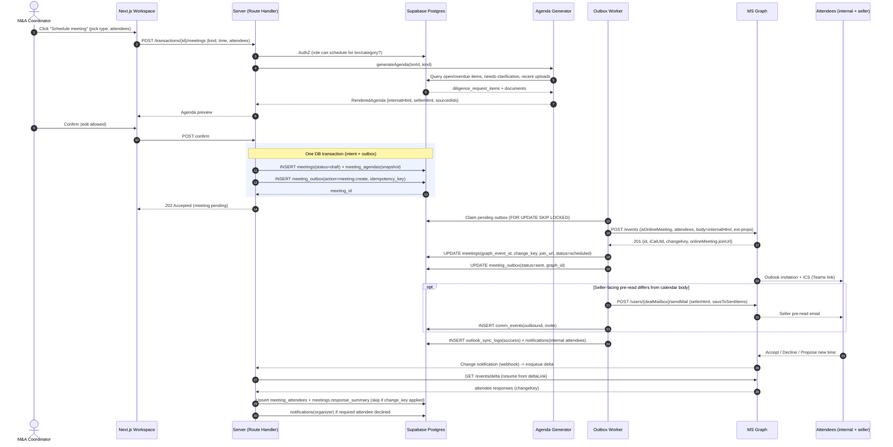

# 07 — Outlook / Microsoft 365 Integration Plan

**Platform:** Healthcare Mergers & Acquisitions Diligence Workflow Platform
**Audience:** Engineering, Platform/Integrations, M&A Operations, Security/Compliance
**Status:** Implementation-grade specification
**Depends on:** `03-database-schema.md` (authoritative tables/enums: `meetings`, `outlook_sync_logs`, `reminder_schedules`, `notifications`), `02-roles-permissions-matrix.md`, `05-diligence-template-schema.md`
**Last reviewed:** 2026-06-26

---

## 1. Purpose & Scope

This document specifies how the platform integrates with **Microsoft 365 / Outlook via Microsoft Graph** to turn the transaction workspace into a scheduling and communications hub. The acquiring company's M&A Coordinators and reviewers schedule, run, and chase the cadence of diligence meetings without leaving the deal — and the diligence state of the deal (missing items, recent uploads, overdue requests) is what *drives* those meetings.

It covers, end to end:

1. **Identity, permissions, and the Graph consent model** — which Graph scopes we request and why (`Calendars.ReadWrite`, `Mail.Send` / `Mail.ReadWrite`, `OnlineMeetings.ReadWrite`), application vs. delegated, and the mailbox-scoping guardrails that keep this safe in a multi-deal tenant.
2. **Scheduling meetings from the workspace** — creating Outlook events, inviting internal + external attendees, attaching Teams/online meetings, and tracking attendee responses.
3. **Two-way calendar sync** — create/update/cancel propagation, delta-query reconciliation, change notifications (webhooks), and idempotency.
4. **Auto-generated agendas** — per-meeting-type templates assembled from *missing diligence items* and *recent uploads*, rendered into the event body and the invitation email.
5. **Email automation** — invites, follow-ups, reminder emails, and the tie-in to the existing reminder scheduler (`reminder_schedules`).
6. **Communication history** — what we can durably capture (sends we originate, meeting lifecycle, attendee responses) and the limits of what we capture from inbound mail.
7. **Operational schema** — the extended `outlook_sync_log` model, idempotency keys, and the supporting `meeting_*` tables.

### 1.1 Non-Goals

- We are **not** building a full mail client. Inbound mail capture is scoped to deal mailboxes/shared mailboxes and explicit BCC capture, not blanket reading of internal users' personal inboxes.
- We do **not** store meeting *recordings* or transcripts in this platform (that is a separate Teams/compliance concern); we store the join URL and lifecycle metadata only.
- PHI handling rules (BAA, Azure OpenAI) from `03`/`05` are inherited, not re-specified here. Agenda generation runs on diligence *metadata* (item names, statuses, dates), never on document bytes or PHI.

### 1.2 Design invariants

| # | Invariant |
|---|-----------|
| I-1 | **Graph is the system of record for the calendar event and the email message; Postgres is the system of record for the *deal linkage* and *intent*.** Our `meetings` row holds the deal context and the `graph_event_id` pointer; Graph holds the canonical event state. Conflicts are reconciled toward Graph for event fields and toward Postgres for deal linkage. |
| I-2 | **Every outbound Graph mutation is idempotent.** Every create/update/cancel/send carries a deterministic idempotency key so retries and webhook races never double-book, double-send, or duplicate cancels. |
| I-3 | **The seller never sees internal context.** Agendas and emails sent to the external Seller/Acquisition Candidate are rendered from *seller-facing* fields only (seller-facing notes, request status), never internal notes, internal review status, AI confidence, or risk. Two render paths, one per audience. |
| I-4 | **No silent failures.** Every sync run and every outbound send writes a row to `outlook_sync_logs` (telemetry) and, on user-visible failure, a `notifications` row to the actor. |
| I-5 | **Least mailbox.** We act from a small set of governed mailboxes (deal mailbox + delegated coordinators who consented), not arbitrary tenant mailboxes. Application permissions are constrained by an Exchange **application access policy**. |

---

## 2. Microsoft Graph: Permissions & Auth Model

### 2.1 Scopes

We use a hybrid model: **delegated** permissions when a specific coordinator is acting "as themselves" (so the event/email shows their identity and lands in their sent items), and **application** permissions for unattended background work (delta sync workers, scheduled reminder sends from the deal mailbox).

| Graph permission | Type | Used for |
|------------------|------|----------|
| `Calendars.ReadWrite` | Delegated + Application | Create/update/cancel events on the organizer's (or deal mailbox's) calendar; read attendee responses; delta sync. |
| `Mail.Send` | Delegated + Application | Send invitations, follow-ups, reminder emails. |
| `Mail.ReadWrite` | Delegated (deal mailbox) + Application (deal/shared mailbox only) | Create draft messages, save to Sent Items, read inbound mail in the **deal mailbox only** for communication history (see §9). |
| `OnlineMeetings.ReadWrite` | Delegated (preferred) | Create Teams online meetings and obtain `joinUrl`. Application form requires an **application access policy**; we scope it to organizer mailboxes only. |
| `User.Read` / `User.ReadBasic.All` | Delegated / Application | Resolve internal attendee email/UPN, time zones, working hours for availability. |
| `Calendars.Read` (Schedule) via `getSchedule` | Delegated/Application | Free/busy lookup for "find a time" (mirrors the `find_meeting_availability` capability). |

> **Why application access policies matter.** `Calendars.ReadWrite` and `Mail.Send` as *application* permissions are tenant-wide by default — the app could read/send as any mailbox. We constrain this with an Exchange Online **application access policy** bound to a mail-enabled security group (`grp-m365-deal-automation`) containing only deal mailboxes and consenting coordinators. This is a hard control, enforced server-side by Exchange, and is documented in the security runbook.

### 2.2 Token strategy

- **Background workers** (delta sync, reminder dispatch) use the **client credentials** flow → app-only token, cached with refresh-ahead, scoped by the application access policy.
- **Interactive scheduling** ("Schedule meeting" button) uses the signed-in coordinator's **delegated** token (On-Behalf-Of from the Next.js server, Entra ID session). This makes the coordinator the organizer, so responses route to them and the event appears in their Outlook.
- **Deal-mailbox mode** (optional per deal): a transaction can be configured to organize from a shared **deal mailbox** (`deal-{shortcode}@acq.com`) so the deal's calendar/comms survive coordinator turnover. In this mode we use app-only tokens against that one mailbox.

### 2.3 Mapping to roles (`02-roles-permissions-matrix.md`)

| Role | Calendar/email capability |
|------|----------------------------|
| **Admin** | Configure deal mailbox, manage application access policy membership, view all sync logs. |
| **M&A Coordinator** | Full scheduling: create/update/cancel meetings, send invites/follow-ups/reminders, run agendas, for transactions they lead. |
| **Executive Leadership** | Schedule/attend Executive reviews; receive invites; read-only on other meetings. |
| **Finance / Operations / Legal / HR Reviewer** | Schedule and own meetings *within their category* (e.g., Finance Reviewer owns Financial diligence review); be invited to others. |
| **Seller / Acquisition Candidate** | **Never** an organizer. Receives invitations and emails. Sees only seller-facing agenda content. May accept/decline via standard Outlook/ICS — captured as a response. Cannot see internal attendees' availability or other deals. |

---

## 3. Meeting Types

The generic `meeting_kind` enum in `03` (`intro`, `diligence_review`, `management_presentation`, `site_visit`, `closing`, `internal`) is **too coarse** to drive per-type agendas and templates. We refine it. Rather than break the existing enum, we add the specific types and keep a `meeting_subtype` for agenda templating.

```sql
-- Extend the closed enum with the specific, agenda-bearing meeting types.
ALTER TYPE meeting_kind ADD VALUE IF NOT EXISTS 'intro_call';
ALTER TYPE meeting_kind ADD VALUE IF NOT EXISTS 'data_request_review';
ALTER TYPE meeting_kind ADD VALUE IF NOT EXISTS 'financial_review';
ALTER TYPE meeting_kind ADD VALUE IF NOT EXISTS 'revenue_cycle_review';
ALTER TYPE meeting_kind ADD VALUE IF NOT EXISTS 'operations_review';
ALTER TYPE meeting_kind ADD VALUE IF NOT EXISTS 'hr_review';
ALTER TYPE meeting_kind ADD VALUE IF NOT EXISTS 'legal_review';
ALTER TYPE meeting_kind ADD VALUE IF NOT EXISTS 'it_transition_review';
ALTER TYPE meeting_kind ADD VALUE IF NOT EXISTS 'executive_review';
ALTER TYPE meeting_kind ADD VALUE IF NOT EXISTS 'closing_prep';
-- 'intro', 'site_visit', 'management_presentation' remain valid for ad-hoc use.
```

The ten first-class meeting types, each bound to the diligence category (A–H) whose state seeds its agenda:

| # | Meeting type | `meeting_kind` | Diligence categories sourced | Default audience | Default owner role | Default duration | Default online |
|---|--------------|----------------|-------------------------------|------------------|--------------------|------------------|----------------|
| 1 | **Introductory call** | `intro_call` | — (relationship/kickoff) | Coordinator, Exec, Seller principals | Coordinator | 30 min | Teams |
| 2 | **Data request review** | `data_request_review` | All open Pre-Signing items (A–H) | Coordinator, Seller, category reviewers | Coordinator | 45 min | Teams |
| 3 | **Financial diligence review** | `financial_review` | B Finance/Accounting | Finance Reviewer, Coordinator, Seller finance | Finance Reviewer | 60 min | Teams |
| 4 | **Revenue cycle review** | `revenue_cycle_review` | C Revenue Cycle/Billing | Finance/Ops Reviewer, Seller billing | Finance Reviewer | 60 min | Teams |
| 5 | **Operations diligence review** | `operations_review` | E Operations/Clinical | Operations Reviewer, Seller ops/clinical | Operations Reviewer | 60 min | Teams |
| 6 | **HR diligence review** | `hr_review` | F HR/Payroll | HR Reviewer, Seller HR | HR Reviewer | 45 min | Teams |
| 7 | **Legal diligence review** | `legal_review` | H Legal/Contracts/Business | Legal/Compliance Reviewer, Seller counsel | Legal Reviewer | 60 min | Teams |
| 8 | **IT transition review** | `it_transition_review` | G IT/EMR/Systems (+ A Logins, post-signing) | Operations Reviewer, IT, Seller IT | Operations Reviewer | 60 min | Teams |
| 9 | **Executive review** | `executive_review` | Roll-up: deal health, risk, blockers (all) | Executive Leadership, Coordinator | Executive | 30 min | Teams |
| 10 | **Closing preparation** | `closing_prep` | Open Post-Signing items + closing checklist | Coordinator, Legal, Exec, Seller principals | Coordinator | 60 min | Teams |

> **Category D — Providers/Credentialing** is sourced into the **Operations** and **HR** reviews by default (credentialing spans both); a deal may add a dedicated `diligence_review` meeting for it. **Category A — Logins/Passwords** is intentionally surfaced only in **IT transition review** and only when the deal is post-signing, honoring its default Post-Signing, secure-credential treatment.

---

## 4. Scheduling a Meeting from the Transaction Workspace

### 4.1 User flow

1. Coordinator opens a transaction → **Meetings** tab → **Schedule meeting**.
2. Picks a **meeting type** (§3). The form pre-fills owner, default duration, default attendee set (internal category reviewers + mapped seller contacts), and the online-meeting toggle.
3. (Optional) **Find a time**: we call Graph `getSchedule` (and `find_meeting_availability`) across internal attendees' calendars to propose free slots; seller availability is requested via email, not read.
4. The system **previews the auto-generated agenda** (§6) so the coordinator can edit before sending.
5. Coordinator confirms → server creates the `meetings` row (status `draft`), then the Graph event with the Teams meeting, then sends invites. All three steps are wrapped in the idempotency contract (§7).

### 4.2 Server-side sequence (create)

1. **Validate & authorize** — actor has scheduling rights for this transaction/category (`02`).
2. **Resolve attendees** — map internal `users` (UPN/email, time zone) and `transaction_contacts` (seller email, `contact_type`) into Graph attendee objects with `type: required|optional`. Seller contacts are always `required` for category reviews they own, `optional` otherwise.
3. **Build agenda** (§6) — two renders: internal body and seller-facing body. The Graph event body uses the **internal** render (internal calendar); the **invitation email** to seller contacts uses the seller-facing render.
4. **Compute idempotency key** (§7.1) and check `meeting_outbox` for a prior attempt.
5. **Create Graph event** with `isOnlineMeeting: true`, `onlineMeetingProvider: "teamsForBusiness"` (Graph mints the Teams meeting and returns `onlineMeeting.joinUrl`). Persist `graph_event_id`, `online_join_url`, `i_cal_uid`, `change_key`.
6. **Persist** `meetings` row → status `scheduled`; attendees into `meeting_attendees`; agenda snapshot into `meeting_agendas`.
7. **Emit** `notifications` (in-app) to internal attendees and an `audit_logs` row (`action='create'`, `entity='meeting'`).

Graph event creation payload (delegated, organizer = coordinator):

```jsonc
POST /me/events            // or /users/{dealMailbox}/events in deal-mailbox mode
{
  "subject": "Financial Diligence Review — Riverbend Family Medicine",
  "body": { "contentType": "HTML", "content": "<internal agenda html>" },
  "start": { "dateTime": "2026-07-08T15:00:00", "timeZone": "America/Chicago" },
  "end":   { "dateTime": "2026-07-08T16:00:00", "timeZone": "America/Chicago" },
  "isOnlineMeeting": true,
  "onlineMeetingProvider": "teamsForBusiness",
  "allowNewTimeProposals": true,
  "responseRequested": true,
  "attendees": [
    { "emailAddress": { "address": "finance@acq.com", "name": "F. Reviewer" }, "type": "required" },
    { "emailAddress": { "address": "cfo@riverbend.example", "name": "Seller CFO" }, "type": "required" }
  ],
  "transactionId": null,                         // not a Graph field; see singleValueExtendedProperties
  "singleValueExtendedProperties": [
    { "id": "String {<guid>} Name DealTransactionId", "value": "<transaction uuid>" },
    { "id": "String {<guid>} Name DealMeetingId",     "value": "<meetings.id>" }
  ]
}
```

> **Extended properties as the back-link.** We stamp our `transaction_id` and `meetings.id` onto the Graph event via `singleValueExtendedProperties`. This lets the delta-sync worker re-associate an event to a deal even if our `graph_event_id` mapping is ever lost, and lets us recognize *our* events during delta sync vs. unrelated calendar noise.

### 4.3 Update & cancel

- **Update** (time/attendees/agenda change): `PATCH /events/{id}` with only changed fields; Graph sends update notices and resets affected responses. We bump `meetings.updated_at`, re-snapshot the agenda if it changed, and write a new `meeting_outbox` row keyed to the change set.
- **Cancel**: `POST /events/{id}/cancel` (sends cancellation to attendees) — preferred over `DELETE`, which silently removes without notifying. We set `meetings.status='cancelled'`, retain the row for history, and write an audit entry. A `DELETE` is used only for never-sent drafts.

---

## 5. Teams / Online Meetings

- Default path: set `isOnlineMeeting: true` on event create — Graph provisions the Teams meeting atomically with the event and returns `onlineMeeting.joinUrl`. This is the preferred approach (one call, no orphan meetings).
- Standalone path (`POST /me/onlineMeetings`) is used only when we need a join URL *before* an event exists (rare; e.g., a persistent deal "war room" link). Requires `OnlineMeetings.ReadWrite`.
- We persist `online_join_url` on `meetings` and include it in both the internal agenda and the seller-facing invitation. We never persist dial-in PINs or conference IDs in plaintext beyond what Graph returns in the join blob; if stored, they live in the encrypted `meetings.online_meeting` jsonb.
- **Application-permission caveat:** creating online meetings app-only requires an application access policy granting the app rights on the organizer's mailbox. Deal-mailbox mode therefore requires the deal mailbox to be in `grp-m365-deal-automation`.

---

## 6. Auto-Generated Agendas

The differentiator: agendas are **assembled from diligence state**, not typed by hand. For a meeting of type *T* on transaction *X*, the agenda generator queries the deal's `diligence_request_items` and recent `documents`/`document_versions` and renders a template.

### 6.1 Inputs (per meeting type)

For the categories mapped to the meeting type (§3 table), the generator pulls:

1. **Missing / open items** — `diligence_request_items` where `diligence_status IN ('pending')` OR `internal_review_status IN ('under_review','needs_clarification','rejected','overdue')`, ordered by `due_date` then risk. These become the "Items to discuss / outstanding requests" block.
2. **Overdue items** — subset of the above with `internal_review_status='overdue'` or `due_date < now()` and not terminal — surfaced as a highlighted "Past due" block.
3. **Needs-clarification items** — `internal_review_status='needs_clarification'` — become explicit agenda questions, each with its seller-facing note.
4. **Recent uploads** — `documents` (via `document_versions`) with `created_at >= last_meeting_of_type OR now() - interval '14 days'`, joined to their request item — "New since last meeting" block, so reviewers can confirm receipt and acceptance live.
5. **Blockers / dependencies** — items flagged `human_review_required` or tied to open `tasks` (from `08` collaboration model).
6. **Roll-up metrics** (executive_review only) — deal-health score, % complete by category, count overdue, top risks (from the analytics roll-up table in `03`).

### 6.2 Template per meeting type

Each type has a template (stored in `meeting_agenda_templates`, admin-editable; seeded with the defaults below). A template is an ordered list of **blocks**, each block being a typed query against the inputs above plus static prose.

| Meeting type | Agenda block sequence |
|--------------|------------------------|
| Introductory call | Welcome & introductions · Deal overview & timeline · How the diligence portal works · Key contacts exchange · Next steps / first data request |
| Data request review | Portal walkthrough · **Outstanding requests by category (A–H)** · **Past due items** · Upload how-to & deadlines · Q&A |
| Financial diligence review | **Open Finance (B) items** · **Recent finance uploads** · **Needs-clarification questions (B)** · Quality-of-earnings topics · Action items & owners |
| Revenue cycle review | **Open Rev Cycle (C) items** · Payer mix & AR aging discussion · **Recent C uploads** · **Clarification questions (C)** · Action items |
| Operations diligence review | **Open Ops/Clinical (E) items** · Provider/credentialing (D) touchpoints · **Recent E/D uploads** · Site/staffing topics · Action items |
| HR diligence review | **Open HR/Payroll (F) items** · Census, benefits, comp topics · Credentialing (D) overlap · **Recent F uploads** · Action items |
| Legal diligence review | **Open Legal (H) items** · Material contracts & assignments · Compliance/regulatory · **Recent H uploads** · **Clarification questions (H)** · Action items |
| IT transition review | **Open IT/EMR (G) items** · EMR/PM migration plan · **Logins/credentials (A) — post-signing only** · Cutover timeline · Action items |
| Executive review | **Deal-health roll-up** · % complete by category · **Top risks & blockers** · Past-due summary · Go/no-go & decisions |
| Closing preparation | **Open Post-Signing items** · Closing checklist & funds-flow readiness · Transition/Day-1 plan · Outstanding signatures · Action items |

### 6.3 Rendering

- Two outputs per agenda: **internal HTML** (full detail: internal review status, due dates, owners, risk) and **seller-facing HTML** (item names + seller-facing notes + what's still needed + deadlines — *no* internal status/risk/AI fields). Enforces invariant I-3.
- Generated by a deterministic template engine over the query result. Optionally **polished by Azure OpenAI** for tone/summary *only* on the non-PHI metadata (item names/dates/statuses), behind a feature flag and the BAA. The structured agenda is always the source of truth; AI never invents items.
- A **snapshot** of the rendered agenda (both renders + the input item ids) is stored in `meeting_agendas` at send time so we have an immutable record of "what we said we'd discuss," and so re-sends are reproducible.

### 6.4 Agenda generation contract (TypeScript)

```ts
type AgendaBlock =
  | { kind: 'static'; title: string; html: string }
  | { kind: 'open_items'; categories: DiligenceCategory[]; includeOverdue: boolean }
  | { kind: 'recent_uploads'; categories: DiligenceCategory[]; sinceDays: number }
  | { kind: 'clarifications'; categories: DiligenceCategory[] }
  | { kind: 'rollup'; metrics: ('deal_health' | 'pct_complete' | 'top_risks' | 'overdue_count')[] };

interface AgendaTemplate {
  meetingKind: MeetingKind;
  blocks: AgendaBlock[];
}

interface RenderedAgenda {
  meetingId: string;
  internalHtml: string;      // full detail — internal calendar/body
  sellerHtml: string;        // seller-safe — invitation email to external contacts
  sourcedItemIds: string[];  // diligence_request_items snapshot
  sourcedDocumentIds: string[];
  generatedAt: string;       // ISO; stored in meeting_agendas
}
```

---

## 7. Idempotency & Outbox

Network retries, webhook re-deliveries, and at-least-once schedulers make double-execution the default hazard. Every Graph-mutating action goes through a transactional **outbox**.

### 7.1 Idempotency keys

A deterministic key per logical action:

```
idempotency_key = sha256(
  action_type ||           -- meeting.create | meeting.update | meeting.cancel | mail.send
  meeting_id (or null) ||
  message_purpose (or null) ||  -- invite | followup | reminder:{n}
  payload_fingerprint          -- hash of normalized subject/time/attendees/body
)
```

- **meeting.create** keyed on `meeting_id` → at most one Graph event per `meetings` row, ever.
- **meeting.update** keyed on `meeting_id` + payload fingerprint → repeated identical PATCHes are no-ops; a real change yields a new key.
- **mail.send** keyed on `meeting_id` + `message_purpose` + fingerprint → the same reminder is never sent twice; reminder #1 and reminder #2 differ by `message_purpose`.

### 7.2 Outbox flow

1. In one DB transaction: write/transition the `meetings` (or message) row **and** insert a `meeting_outbox` row (`status='pending'`, the idempotency key, the rendered Graph payload).
2. A worker claims `pending` rows (`SELECT … FOR UPDATE SKIP LOCKED`), calls Graph, and on success stores the Graph id and sets `status='sent'`. The unique constraint on `idempotency_key` makes a duplicate claim a guaranteed no-op.
3. On Graph `429/5xx`, mark `status='retry'` with exponential backoff + jitter; respect the `Retry-After` header. After N attempts → `status='failed'`, write `outlook_sync_logs` + a `notifications` row to the actor.
4. Webhooks/delta that reflect *our own* change are recognized by the stored `graph_event_id` + `change_key` and do not re-trigger sends (loop suppression).

---

## 8. Two-Way Calendar Sync

We keep `meetings` reconciled with Outlook using **change notifications (webhooks)** for low latency plus **delta queries** as the authoritative backstop. Webhooks tell us *something changed*; delta tells us *exactly what* and survives missed notifications.

### 8.1 Change notifications (push)

- Subscribe via `POST /subscriptions` to `/me/events` (or `/users/{dealMailbox}/events`) with `changeType: created,updated,deleted`, a `notificationUrl` (our Next.js route handler), a `clientState` secret, and an `expirationDateTime` (Graph caps calendar subscriptions ~3 days; we renew on a timer well before expiry).
- On receipt: validate `clientState`, enqueue a **delta sync** for that resource (we do not trust the notification body for state; it's a trigger). This avoids processing stale/partial payloads and de-duplicates bursts.

### 8.2 Delta query (pull, authoritative)

- `GET /me/calendarView/delta?startDateTime=…&endDateTime=…` (or `/events/delta`) returns changes since the last `deltaLink`. We persist the `deltaToken`/`deltaLink` per (mailbox, transaction) in `outlook_sync_logs` (and a durable cursor table) and resume from it each run.
- A **nightly full reconcile** (windowed `calendarView` over active deals) catches anything missed and re-validates `change_key`s.

### 8.3 What we reconcile, and which way

| Field / event | Conflict resolution |
|---------------|---------------------|
| Event time, subject, body, location, online URL | **Graph wins** (organizer edited in Outlook) → update `meetings`. |
| Cancellation in Outlook | Set `meetings.status='cancelled'`, fire notification. |
| Deal linkage (`transaction_id`, `kind`, agenda snapshot) | **Postgres wins** — Graph can't change these; restamp extended properties if missing. |
| Attendee responses (accept/decline/tentative) | Graph wins → upsert `meeting_attendees.response`, `responded_at`. |
| Our own pending outbox change vs. inbound delta | Outbox (our intended state) wins until `sent`, then delta resumes authority. |

### 8.4 Tracking responses

Each delta over an event refreshes `event.attendees[].status.response` (`none|accepted|tentativelyAccepted|declined`) and `status.time`. We upsert into `meeting_attendees`, recompute a per-meeting **response summary** (`accepted/declined/pending` counts) on `meetings`, and notify the organizer when a **required** attendee declines or proposes a new time. Seller accept/decline via ICS is captured the same way when responses route back to the organizer mailbox.

### 8.5 Idempotency in sync

- Apply changes keyed by `(graph_event_id, change_key)`; if we've already applied that `change_key`, skip. This makes webhook + delta + nightly reconcile safely overlapping (each is at-least-once; application is exactly-once per change_key).

---

## 9. Email Automation

### 9.1 Email types

| Email | Trigger | From | Audience | Body source |
|-------|---------|------|----------|-------------|
| **Invitation** | Meeting scheduled | Organizer / deal mailbox | Internal + seller attendees | Seller-facing agenda (external) / internal agenda (internal). ICS via Graph event. |
| **Update notice** | Meeting time/agenda changed | Organizer | Affected attendees | Graph-native on `PATCH` + our delta of the agenda block. |
| **Follow-up** | Meeting end (+configurable delay) | Organizer | Attendees | Recap: decisions, **new/changed action items**, items moved to *needs clarification*, next steps. Assembled from agenda snapshot + post-meeting diligence deltas. |
| **Reminder (item-level)** | `reminder_schedules` due (existing engine) | Deal mailbox | Seller contact / internal owner | Outstanding/overdue items for that recipient. |
| **Reminder (meeting)** | T-24h / T-1h before `starts_at` | Organizer / deal mailbox | Attendees | Join link + agenda highlights + "please upload before". |
| **Weekly digest** | Cadence (`reminder_schedules`, weekly) | Deal mailbox | Seller principals / coordinator | Per-category open/overdue counts + recent activity. |

### 9.2 Sending mechanics

- **Invitations** are inherent to the Graph event create (Outlook sends the meeting invite + ICS to all attendees). We do **not** also send a separate "invite email" for the same meeting — that would double-notify. We *do* send a separate **seller-facing pre-read** email when the seller-facing agenda differs from what Outlook shows (since the calendar body carries the internal render). Configurable per deal.
- **All other emails** are sent via `POST /me/sendMail` (delegated) or `POST /users/{dealMailbox}/sendMail` (app-only), each with `saveToSentItems: true` so the message is durably recorded in the mailbox and discoverable for compliance.
- Every send is routed through the **outbox** (§7) with a `message_purpose` so it's idempotent and logged.

`sendMail` example (reminder, app-only, deal mailbox):

```jsonc
POST /users/deal-riverbend@acq.com/sendMail
{
  "message": {
    "subject": "Reminder: 3 outstanding diligence items — Riverbend",
    "body": { "contentType": "HTML", "content": "<seller-facing reminder html>" },
    "toRecipients": [{ "emailAddress": { "address": "cfo@riverbend.example" } }],
    "internetMessageHeaders": [
      { "name": "x-deal-transaction-id", "value": "<transaction uuid>" },
      { "name": "x-deal-message-purpose", "value": "reminder:2" }
    ]
  },
  "saveToSentItems": true
}
```

> Custom `x-deal-*` headers let inbound-capture and Sent-Items scans re-link a message to a deal and dedupe by purpose.

### 9.3 Reminder automation tie-in

The reminder *cadence engine* already exists (`reminder_schedules` in `03`, with `reminder_cadence`, `cron_expr`, `next_run_at`, `target_user_id`/`target_contact_id`). This integration is the **delivery channel** for email reminders; it does not re-implement scheduling.

```
reminder_schedules (due row)
        │  scheduler worker selects next_run_at <= now() AND is_active
        ▼
build recipient + outstanding-items payload (per target)
        │
        ▼
notifications row (in_app, channel='email')  ──►  outbox (mail.send, message_purpose='reminder:{n}')
        │                                              │
        ▼                                              ▼
advance next_run_at / last_run_at               Graph sendMail (deal mailbox)  ──►  outlook_sync_logs
```

- **Meeting reminders** (T-24h/T-1h) are derived rows the scheduler synthesizes from upcoming `meetings`, reusing the same path with `message_purpose='reminder:meeting:{offset}'`.
- **Suppression rules:** no reminder if the item became terminal (`accepted`/`internal_review_complete`/`not_applicable`/`denied`) since the schedule fired; no meeting reminder if the meeting was cancelled; respect a per-deal quiet-hours window and a max-reminders cap to avoid harassing sellers.
- **Channel fan-out:** `notification_channel` (`in_app`,`email`,`teams`) controls whether a reminder also posts to a Teams channel (deal war-room) via an incoming webhook or Graph chat message — same payload, different sink.

---

## 10. Communication History

We durably capture what we can attribute, and we are explicit about the limits.

**Captured (high confidence):**
- Every email we *originate* (invites, follow-ups, reminders, digests) — via the outbox + `saveToSentItems` + a `comm_events` row linking `transaction_id`, `meeting_id`/`request_item_id`, `message_purpose`, Graph `internetMessageId`, recipients, and send time.
- Every meeting lifecycle event (created/updated/cancelled) and attendee response — from `meetings` + `meeting_attendees` + delta.
- In **deal-mailbox mode**, inbound replies to the deal mailbox — a delta over the deal mailbox's `messages` (with `Mail.ReadWrite` scoped to that one mailbox) links inbound mail to the deal by `conversationId`, custom header, or recipient matching, and writes `comm_events` (`direction='inbound'`).

**Not captured (by design / limitation):**
- Internal users' personal inbox traffic. We do not read coordinators' or reviewers' general mailboxes — only the deal mailbox and only with explicit configuration. To capture an internal user's relevant external thread, they **BCC the deal mailbox** (`bcc-{shortcode}@acq.com`), which we then ingest like any inbound deal-mailbox message.
- We cannot see emails sent entirely outside our mailboxes/tooling. The history is "complete for what flowed through the deal mailbox or our send path," and the UI states this.

**Surfacing:** the transaction workspace shows a unified **Communications** timeline merging `comm_events` (email), `meetings` (calendar), `notifications`, and (read-only links to) related `documents`, filterable by category and contact.

---

## 11. Schema: `outlook_sync_log` and Supporting Tables

The `03` schema defines `outlook_sync_logs` minimally. This integration **extends** it for delta cursors and idempotency, and adds the meeting-support tables. Presented as forward migrations.

### 11.1 Extend `outlook_sync_logs`

```sql
ALTER TABLE outlook_sync_logs
  ADD COLUMN IF NOT EXISTS mailbox          text,                       -- UPN/deal mailbox synced
  ADD COLUMN IF NOT EXISTS trigger          text NOT NULL DEFAULT 'schedule', -- 'webhook' | 'delta' | 'schedule' | 'manual'
  ADD COLUMN IF NOT EXISTS subscription_id  text,                       -- Graph subscription that fired
  ADD COLUMN IF NOT EXISTS delta_link       text,                       -- next deltaLink (companion to delta_token)
  ADD COLUMN IF NOT EXISTS items_created    integer NOT NULL DEFAULT 0,
  ADD COLUMN IF NOT EXISTS items_updated    integer NOT NULL DEFAULT 0,
  ADD COLUMN IF NOT EXISTS items_deleted    integer NOT NULL DEFAULT 0,
  ADD COLUMN IF NOT EXISTS items_skipped    integer NOT NULL DEFAULT 0, -- idempotent no-ops (already-applied change_key)
  ADD COLUMN IF NOT EXISTS correlation_id   uuid;                       -- ties a run to its outbox attempts / request id

CREATE INDEX IF NOT EXISTS idx_outsync_mailbox_time ON outlook_sync_logs (mailbox, started_at DESC);
CREATE INDEX IF NOT EXISTS idx_outsync_sub          ON outlook_sync_logs (subscription_id);
```

Resulting effective `outlook_sync_logs` shape:

| Column | Type | Notes |
|--------|------|-------|
| `id` | `uuid` PK | |
| `transaction_id` | `uuid` FK → `transactions.id` NULL | null for tenant-wide runs |
| `mailbox` | `text` NULL | UPN or deal mailbox |
| `direction` | `text` | `inbound` / `outbound` |
| `resource` | `text` | `calendar` / `mail` |
| `trigger` | `text` | `webhook` / `delta` / `schedule` / `manual` |
| `subscription_id` | `text` NULL | Graph change-notification subscription |
| `status` | `sync_status` | `success`/`partial`/`failed`/`skipped` |
| `delta_token` / `delta_link` | `text` NULL | Graph delta cursor(s) for resume |
| `items_processed` | `integer` | total seen |
| `items_created`/`items_updated`/`items_deleted`/`items_skipped` | `integer` | breakdown; `items_skipped` = idempotent no-ops |
| `correlation_id` | `uuid` NULL | links to outbox attempts / request id |
| `error` | `jsonb` NULL | Graph error code/message/`Retry-After` |
| `started_at` / `finished_at` | `timestamptz` | |

### 11.2 Durable delta cursor

`outlook_sync_logs` is telemetry (one row per run); the *resumable* cursor lives in its own small table so a failed run never corrupts the resume point.

```sql
CREATE TABLE outlook_delta_cursors (
  id              uuid PRIMARY KEY DEFAULT gen_random_uuid(),
  mailbox         text NOT NULL,
  resource        text NOT NULL,                 -- 'calendar' | 'mail'
  transaction_id  uuid REFERENCES transactions(id) ON DELETE CASCADE,
  delta_link      text,                          -- opaque Graph deltaLink for next run
  subscription_id text,                          -- active change-notification subscription
  subscription_expires_at timestamptz,           -- renew before this
  last_success_at timestamptz,
  created_at      timestamptz NOT NULL DEFAULT now(),
  updated_at      timestamptz NOT NULL DEFAULT now(),
  UNIQUE (mailbox, resource, transaction_id)
);
```

### 11.3 Meeting outbox (idempotent Graph mutations)

```sql
CREATE TYPE outbox_status AS ENUM ('pending','sent','retry','failed','cancelled');

CREATE TABLE meeting_outbox (
  id              uuid PRIMARY KEY DEFAULT gen_random_uuid(),
  transaction_id  uuid NOT NULL REFERENCES transactions(id) ON DELETE CASCADE,
  meeting_id      uuid REFERENCES meetings(id) ON DELETE CASCADE,
  action_type     text NOT NULL,                 -- meeting.create|update|cancel | mail.send
  message_purpose text,                          -- invite|followup|reminder:{n}|null
  idempotency_key text NOT NULL UNIQUE,          -- sha256 (see §7.1)
  payload         jsonb NOT NULL,                -- rendered Graph request body
  status          outbox_status NOT NULL DEFAULT 'pending',
  attempts        integer NOT NULL DEFAULT 0,
  next_attempt_at timestamptz NOT NULL DEFAULT now(),
  graph_id        text,                          -- event id / internetMessageId on success
  last_error      jsonb,
  correlation_id  uuid,
  created_at      timestamptz NOT NULL DEFAULT now(),
  updated_at      timestamptz NOT NULL DEFAULT now()
);
CREATE INDEX idx_outbox_claim ON meeting_outbox (next_attempt_at) WHERE status IN ('pending','retry');
CREATE INDEX idx_outbox_meeting ON meeting_outbox (meeting_id);
```

### 11.4 Meeting attendees, agendas, templates

```sql
CREATE TYPE attendee_kind     AS ENUM ('internal','seller');
CREATE TYPE attendee_role     AS ENUM ('required','optional','resource');
CREATE TYPE attendee_response AS ENUM ('none','accepted','tentative','declined');

CREATE TABLE meeting_attendees (
  id            uuid PRIMARY KEY DEFAULT gen_random_uuid(),
  meeting_id    uuid NOT NULL REFERENCES meetings(id) ON DELETE CASCADE,
  user_id       uuid REFERENCES users(id),               -- internal
  contact_id    uuid REFERENCES transaction_contacts(id),-- seller
  email         citext NOT NULL,
  kind          attendee_kind NOT NULL,
  role          attendee_role NOT NULL DEFAULT 'required',
  response      attendee_response NOT NULL DEFAULT 'none',
  responded_at  timestamptz,
  created_at    timestamptz NOT NULL DEFAULT now(),
  UNIQUE (meeting_id, email)
);

CREATE TABLE meeting_agendas (              -- immutable snapshot per send
  id                 uuid PRIMARY KEY DEFAULT gen_random_uuid(),
  meeting_id         uuid NOT NULL REFERENCES meetings(id) ON DELETE CASCADE,
  generated_at       timestamptz NOT NULL DEFAULT now(),
  internal_html      text NOT NULL,
  seller_html        text NOT NULL,
  sourced_item_ids   uuid[] NOT NULL DEFAULT '{}',
  sourced_document_ids uuid[] NOT NULL DEFAULT '{}',
  generator_version  text NOT NULL,
  created_by         uuid REFERENCES users(id)
);

CREATE TABLE meeting_agenda_templates (     -- admin-editable, seeded with §6.2
  id           uuid PRIMARY KEY DEFAULT gen_random_uuid(),
  meeting_kind meeting_kind NOT NULL,
  version      integer NOT NULL DEFAULT 1,
  blocks       jsonb NOT NULL,              -- AgendaBlock[]
  is_active    boolean NOT NULL DEFAULT true,
  created_at   timestamptz NOT NULL DEFAULT now(),
  UNIQUE (meeting_kind, version)
);
```

### 11.5 Communication events (history)

```sql
CREATE TYPE comm_direction AS ENUM ('outbound','inbound');
CREATE TYPE comm_channel   AS ENUM ('email','meeting_invite','meeting_update','meeting_cancel','teams');

CREATE TABLE comm_events (
  id                 uuid PRIMARY KEY DEFAULT gen_random_uuid(),
  transaction_id     uuid NOT NULL REFERENCES transactions(id) ON DELETE CASCADE,
  meeting_id         uuid REFERENCES meetings(id) ON DELETE SET NULL,
  request_item_id    uuid REFERENCES diligence_request_items(id) ON DELETE SET NULL,
  direction          comm_direction NOT NULL,
  channel            comm_channel NOT NULL,
  message_purpose    text,                                 -- invite|followup|reminder:{n}|inbound_reply
  subject            text,
  internet_message_id text,                                -- Graph message id
  conversation_id    text,                                 -- Graph thread id
  from_address       citext,
  to_addresses       citext[],
  graph_sync_log_id  uuid REFERENCES outlook_sync_logs(id),
  occurred_at        timestamptz NOT NULL,
  created_at         timestamptz NOT NULL DEFAULT now()
);
CREATE INDEX idx_comm_txn_time ON comm_events (transaction_id, occurred_at DESC);
CREATE INDEX idx_comm_conv      ON comm_events (conversation_id);
CREATE UNIQUE INDEX uq_comm_msg ON comm_events (internet_message_id, direction)
  WHERE internet_message_id IS NOT NULL;   -- idempotent inbound ingest
```

### 11.6 `meetings` augmentation

```sql
ALTER TABLE meetings
  ADD COLUMN IF NOT EXISTS status            text NOT NULL DEFAULT 'draft', -- draft|scheduled|updated|cancelled|completed
  ADD COLUMN IF NOT EXISTS i_cal_uid         text,
  ADD COLUMN IF NOT EXISTS change_key        text,        -- Graph concurrency token; idempotent delta apply
  ADD COLUMN IF NOT EXISTS organizer_mailbox text,        -- coordinator UPN or deal mailbox
  ADD COLUMN IF NOT EXISTS online_meeting    jsonb,       -- join blob (no plaintext PINs beyond Graph payload)
  ADD COLUMN IF NOT EXISTS response_summary  jsonb,       -- {accepted, declined, tentative, pending}
  ADD COLUMN IF NOT EXISTS last_synced_at    timestamptz;
```

> **RLS** on all new tables follows the deal-isolation pattern from `03`: every row carries `transaction_id` (directly or via `meeting_id`), seller identities can read only rows for their single transaction and only seller-facing fields (`seller_html`, not `internal_html`), and the append-only `audit_logs` records every mutation. `meeting_outbox`/`outlook_delta_cursors` are service-role only (no seller/reviewer access).

---

## 12. Sequence Diagram — Schedule Meeting with Auto-Agenda



---

## 13. Workers, Scheduling & Hosting

| Worker | Cadence | Responsibility |
|--------|---------|----------------|
| **Outbox dispatcher** | Continuous (queue/poll, ~10s) | Drain `meeting_outbox`; call Graph; retry with backoff. |
| **Calendar delta sync** | Webhook-triggered + every 15 min backstop + nightly full reconcile | Pull `events/delta`/`calendarView/delta`; reconcile `meetings`/`meeting_attendees`; update cursors. |
| **Mail delta sync** (deal-mailbox mode) | Webhook + 15 min | Ingest inbound deal-mailbox replies → `comm_events`. |
| **Subscription renewer** | Hourly | Renew Graph change-notification subscriptions before `expirationDateTime`. |
| **Reminder dispatcher** | Per `reminder_schedules.next_run_at` (+ T-24h/T-1h meeting reminders) | Build payloads → outbox `mail.send`. |
| **Token/cert rotation** | On schedule | Rotate client secret/cert; refresh app-only tokens. |

Hosting: workers run as **Azure Container Apps jobs** (or Vercel Cron + a durable queue) using the app-only identity; the `notificationUrl` for webhooks is a public, signed Next.js route handler. All workers are stateless and idempotent (§7), so horizontal scale and at-least-once delivery are safe.

---

## 14. Error Handling, Throttling & Resilience

| Condition | Handling |
|-----------|----------|
| Graph `429` / `Retry-After` | Honor `Retry-After`; exponential backoff + jitter in outbox; never busy-loop. |
| Graph `5xx` / timeout | Mark `retry`; cap attempts; then `failed` + actor notification + `outlook_sync_logs(failed)`. |
| Expired delta token (`410 Gone`) | Discard cursor, run a windowed full `calendarView` reconcile, mint fresh `deltaLink`. |
| Missed webhook | Backstop 15-min delta + nightly reconcile guarantee eventual consistency. |
| Subscription lapsed | Renewer re-creates; gap covered by delta backstop. |
| Duplicate webhook / delta overlap | `change_key` de-dupe → counted as `items_skipped`. |
| Consent revoked / policy excludes mailbox | Surface a deal-level banner; pause that deal's automation; alert Admin. |
| Attendee email invalid / NDR | Captured via `comm_events` + (deal-mailbox) NDR ingest; flag contact for correction. |

---

## 15. Security & Compliance Notes

- **Scope minimization & application access policy** (§2) bound the blast radius of app-only `Mail.Send`/`Calendars.ReadWrite` to deal/consenting mailboxes only.
- **Audience separation** (I-3): seller-bound content is always the `seller_html` render; the seller never receives internal review status, AI confidence, risk, or internal notes.
- **PHI**: agenda generation operates on diligence *metadata*; any AI polish uses Azure OpenAI under BAA on non-PHI fields only. No document bytes traverse the email/calendar path except deliberate, authorized attachments.
- **Secrets**: Graph client secret/cert in Azure Key Vault; webhook `clientState` and `x-deal-*` header signing keys rotated and stored as secrets.
- **Auditability**: every meeting/email mutation writes `audit_logs`; every send is durably in Sent Items (`saveToSentItems`) and `comm_events`; `outlook_sync_logs` gives reconciliation/incident telemetry. Together these make the communications trail defensible for a regulated healthcare transaction.
- **Right to erasure / deal teardown**: closing-lost or NDA-expiry runbooks cancel events, delete subscriptions, and purge `meeting_outbox`/cursors per the data-retention policy in `03`.

---

## 16. Phasing

| Phase | Scope |
|-------|-------|
| **P1 — Manual + invites** | Create/update/cancel events with Teams link; native Outlook invitations; `meetings`/`meeting_attendees`; outbox + idempotency. |
| **P2 — Auto-agenda** | Agenda generator + templates (§6); internal/seller renders; snapshots. |
| **P3 — Sync & responses** | Webhooks + delta; response tracking; extended `outlook_sync_logs` + cursors. |
| **P4 — Email automation** | Follow-ups, meeting reminders, weekly digest; reminder-engine tie-in; `comm_events`. |
| **P5 — Comm history (deal mailbox)** | Inbound ingest, BCC capture, unified Communications timeline. |
| **P6 — Polish** | AI agenda summarization (BAA), Teams channel fan-out, availability "find a time" UX. |
