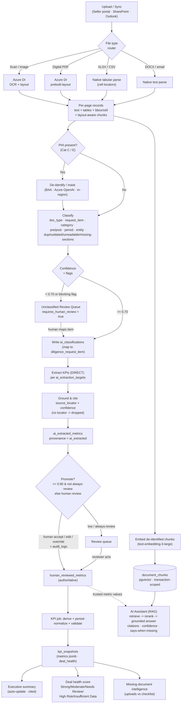

# 08 — AI Architecture Plan

**Platform:** Healthcare Mergers & Acquisitions Diligence Workflow Platform
**Audience:** AI/ML Engineering, Platform/Backend, Security & Compliance, Finance/Operations/Legal Reviewers, Solution Architects
**Status:** Implementation-grade specification
**Tech stack:** Next.js 14 + TypeScript · Supabase Postgres + pgvector · Azure OpenAI / OpenAI · Azure AI Document Intelligence · Microsoft Graph (SharePoint/Outlook)
**Depends on:** `03-database-schema.md` (`ai_classifications`, `ai_extracted_metrics`, `human_reviewed_metrics`, `kpi_snapshots`, `risk_flags`, `audit_logs`), `05-diligence-template-schema.md` (`ai_extraction_targets`, `ai_hint`, A–H spine), `06-sharepoint-integration-plan.md` (document byte source), `09-kpi-extraction-logic.md` (metric catalog, derivation, promotion)
**Last reviewed:** 2026-06-26

---

## 1. Purpose & Scope

This document is the authoritative architecture for every place a model touches data on the platform. It specifies how PHI-bearing healthcare documents flow from a SharePoint-backed data room through parsing, classification, grounded extraction, snapshotting, summarization, deal scoring, and a retrieval-augmented assistant — and how each of those stages is constrained so the acquiring company's reviewers can trust the output.

The platform is operated by an **acquiring** company running diligence on healthcare practices it intends to buy. The eight diligence categories are the spine of everything below:

| Code | Category | PHI exposure | Primary AI workload |
|------|----------|--------------|---------------------|
| **A** | Logins/Passwords | Credentials (secret, not PHI) | Classification only — **never embedded, never sent to a model verbatim** (§13) |
| **B** | Finance/Accounting | Low (financial, generally de-identified) | Classification + heavy KPI extraction |
| **C** | Revenue Cycle/Billing | **High** (claims, demographics) | Classification + KPI extraction, de-identify before model calls |
| **D** | Providers/Credentialing | Medium (provider PII, not patient PHI) | Classification + roster/expiry extraction |
| **E** | Operations/Clinical | **High** (patient demographics, visit data) | Classification + volume extraction, de-identify |
| **F** | HR/Payroll | Medium (employee PII) | Classification + payroll-ratio extraction |
| **G** | IT/EMR/Systems | Low–Medium | Classification + inventory extraction |
| **H** | Legal/Contracts/Business | Low–Medium | Classification + clause/term extraction |

### 1.1 First principles (non-negotiable)

1. **Grounding over fluency.** Every number, claim, and answer is tied to a source document, page, and (where possible) a cell/bounding box. A model that cannot cite does not answer.
2. **Provenance separation.** AI output lands in `ai_classifications` and `ai_extracted_metrics` and is **never** written into human-authoritative columns. It becomes trusted only when a human promotes it into `human_reviewed_metrics` (§3, aligned with `03` §7 and `09` §7).
3. **Confidence is first-class.** Every AI artifact carries a `0–1` confidence and a `requires_human_review` flag that drives routing (§12 threshold policy).
4. **Tenant isolation = `transaction_id`.** Retrieval, RAG, and every snapshot are scoped to a single `transaction_id`. The assistant can never read across deals.
5. **HIPAA-conscious by construction.** PHI only ever reaches a model running under a signed BAA (Azure OpenAI), in the contracted region, after de-identification wherever the task allows (§13).
6. **Humans are accountable, models are assistive.** The system always knows which values are machine-suggested vs. human-accepted, and every override is audited.

### 1.2 What this document is *not*

It is not the metric catalog (that is `09-kpi-extraction-logic.md`), not the relational schema (`03`), and not the diligence checklist itself (`05`). It references those by their canonical field names rather than restating them.

---

## 2. Document Ingestion & Parsing

### 2.1 Trigger and source of bytes

Documents enter through three doors, all of which converge on the same pipeline:

| Source | Mechanism | Reference |
|--------|-----------|-----------|
| Seller upload (portal / upload link) | Browser → Supabase Storage staging → mirrored to SharePoint | `05` upload links, `06` |
| SharePoint drive items | Microsoft Graph delta sync → `sharepoint_files` | `06-sharepoint-integration-plan.md` |
| Email attachment | Outlook/Graph → attachment capture | `07-outlook-integration-plan.md` |

The **authoritative bytes live in SharePoint**; Postgres holds the index, workflow, and AI provenance. A new or changed `document_versions` row enqueues an `ingest` job (one job per `document_version_id`).

### 2.2 Parsing strategy — router by file type

We do not use one parser for everything. A router inspects MIME type, extension, and a fast magic-byte probe, then dispatches:

| File class | Parser | Notes |
|-----------|--------|-------|
| Native digital PDF | Azure DI **prebuilt-layout** | Text + layout + tables, no OCR pass needed |
| Scanned / image PDF, TIFF, JPG/PNG | Azure DI **prebuilt-layout with OCR** | Full OCR; per-page confidence recorded |
| Financial statements (P&L, balance sheet) | Azure DI layout **+ custom financial model** | Table structure + key-value pairs |
| XLSX / XLS / CSV | Native parse (SheetJS / `xlsx`) → normalized grid | Cell addresses preserved as locators; **no OCR** |
| DOCX | `mammoth`/native → text + heading structure | Clause/section boundaries kept |
| Structured exports (claims/AR extracts as CSV) | Schema-sniffing tabular loader | Column mapping to `ai_extraction_targets` |
| Email body / `.eml` / `.msg` | MIME parse | Body becomes a "document"; attachments recurse |

> **Rule:** spreadsheets and digital PDFs are parsed natively/with layout — **OCR is reserved for raster content**. OCR is the most expensive and lossiest path; the router avoids it whenever real text exists.

### 2.3 Per-page text + layout extraction

For every page Azure DI returns, we persist a normalized **page record**:

```jsonc
{
  "document_version_id": "…",
  "page_number": 4,
  "width": 8.5, "height": 11.0, "unit": "inch",
  "ocr_used": false,
  "page_confidence": 0.991,
  "text": "…full reading-order text…",
  "lines":  [ { "text": "Net Patient Revenue", "bbox": [1.1,2.4,3.9,2.6], "conf": 0.98 } ],
  "tables": [ { "row_count": 14, "col_count": 6, "cells": [ /* row,col,text,bbox,conf */ ] } ],
  "key_value_pairs": [ { "key": "Tax Year", "value": "2024", "conf": 0.97 } ]
}
```

This record is the **citation substrate**: every downstream extraction and RAG answer cites `{document, page, bbox|cell}` out of it. Layout (tables, headers, reading order) is retained, not flattened to a text blob, because financial and roster documents are tabular and lose meaning when linearized.

### 2.4 Chunking

Chunking is **layout-aware and document-type-aware**, not a fixed character window:

| Document shape | Chunk unit | Target size | Overlap |
|----------------|-----------|-------------|---------|
| Narrative (contracts, policies, legal) | Heading/section, then recursive split | ~800 tokens | 100 tokens |
| Tabular (P&L, AR aging, rosters) | One table (or row-band of a large table) | Whole table where it fits; else 50-row bands | Repeat header row in each band |
| Spreadsheets | Per-sheet, then per-named-range/region | Region | Header repetition |
| Email | Per-message in a thread | Whole message | None |

Each chunk carries metadata used both for retrieval filtering and for citation: `{transaction_id, document_id, document_version_id, request_item_id, category_code, page_range, chunk_type, table_id?}`. Tables are **never split mid-cell**; header rows are duplicated into each band so a retrieved fragment is self-describing.

### 2.5 Ingestion failure handling

| Condition | Detection | Action |
|-----------|-----------|--------|
| Corrupt / password-protected file | Parser error / encryption flag | Mark version `unreadable`; create a `requires_human_review` classification stub; notify uploader (`07`) |
| Empty / zero-text after OCR | Page text length ≈ 0 | Flag `unreadable`; route to Unclassified Review Queue |
| Oversized (> page/byte cap) | Pre-check | Split or reject with a clear message; never silently truncate |
| Low page OCR confidence | `page_confidence < 0.60` | Keep page, set page-level `low_ocr` flag; downstream extractions inherit a confidence penalty |

---

## 3. Document Classification Pipeline

Classification answers, per document version: **what is this, which diligence request item and category does it satisfy, is it pre- or post-signing, what period and entity does it cover, is it usable, and how sure are we?** Its verdict is written to **`ai_classifications`** (`03` §7.1) and denormalized onto `diligence_request_items.latest_ai_classification_id` / `ai_confidence` / `requires_human_review`.

### 3.1 Inputs to the classifier

1. **Filename + path** (often the strongest weak signal: `2024 T12 PnL Consolidated.xlsx`).
2. **First N pages of normalized text + table headers** (not raw bytes; capped for cost).
3. **Key-value pairs** surfaced by Azure DI (e.g., "Tax Year", "Statement Period", "Provider").
4. **The transaction's open checklist** — the candidate `diligence_request_items` and their `ai_hint` / `ai_extraction_targets` from `05`. Classification is a **constrained match against this list**, not open-vocabulary labeling.

### 3.2 Classifier steps

| # | Step | Output |
|---|------|--------|
| 1 | **Document-type recognition** | A `doc_type` from the taxonomy (§3.5) + confidence |
| 2 | **Request-item + category match** | `request_item_id`, `predicted_category_id`, match confidence |
| 3 | **Timeline determination** | `pre_signing` / `post_signing` (seeded by item's `needed_timeline`, confirmed by content) |
| 4 | **Date-range extraction** | `period_start` / `period_end` (or `as_of` date) |
| 5 | **Entity / location / provider identification** | `{entity_name, location, provider_name?}` |
| 6 | **Quality checks** | duplicate / outdated / unreadable / missing-required-section flags |
| 7 | **Confidence scoring** | a single calibrated `confidence ∈ [0,1]` |
| 8 | **Routing** | auto-accept / human review / Unclassified Review Queue (§12) |

A two-stage design keeps cost and accuracy balanced: a **fast deterministic pass** (filename regexes + header keyword rules + Azure DI `doc_type` hints) proposes a candidate, and an **LLM adjudication pass** (Azure OpenAI, structured-output / JSON schema) confirms or corrects it against the checklist, returning evidence spans. When the deterministic pass is high-agreement with strong signals, the LLM pass can be skipped to save cost (§11).

### 3.3 Quality / anomaly checks (deterministic, run every time)

| Check | How | Resulting flag |
|-------|-----|----------------|
| **Duplicate** | SHA-256 of file bytes + near-duplicate via cosine similarity of the document embedding (≥ 0.97) against existing versions in the same `request_item_id` | `is_duplicate`, link to prior version |
| **Outdated** | Extracted period older than the item's expected window, or superseded by a newer version covering the same period | `is_outdated` |
| **Unreadable** | From ingestion (§2.5): empty text, encryption, OCR failure | `is_unreadable` → forces queue |
| **Missing required sections** | Compare detected sections/fields against the item's `ai_extraction_targets`; e.g., a "T12 P&L" with no EBITDA line, a balance sheet missing liabilities, a roster missing NPI column | `missing_sections: [...]` |
| **Wrong granularity** | Monthly P&L uploaded where a consolidated T12 was requested (or vice-versa) | `granularity_mismatch` |

These flags lower confidence and are surfaced verbatim to the reviewer so they know *why* a file was queued.

### 3.4 Confidence, routing, and human review

`confidence` is a calibrated blend (§11.4) of: doc-type model probability, item-match score, signal agreement between filename and content, and a penalty for any quality flag. Routing follows the global policy in **§12**:

- `confidence ≥ 0.90` and no blocking flag → **auto-accept**; item moves toward `received`, `requires_human_review = false`.
- `0.70 ≤ confidence < 0.90` → **attach but flag** `requires_human_review = true`; reviewer confirms in-line.
- `confidence < 0.70`, or any `is_unreadable` / `granularity_mismatch` / multi-item ambiguity → **Unclassified Review Queue**: `request_item_id` left null, `requires_human_review = true`, a `risk_flags`/task surfaced to the assigned reviewer. A human picks the correct item & category; the chosen mapping is logged and can be fed back as a labeled example (§11.5).

Every classification — accepted or queued — writes `ai_classifications.raw_output` (full model JSON), `model_provider`, `model_name`, `prompt_fingerprint`, and on resolution `reviewed_by` / `review_outcome` (`accepted` / `overridden` / `rejected`).

### 3.5 Classification taxonomy (example document types)

Each `doc_type` maps to a default category and the request items it typically satisfies. This is **reference data**, code-versioned and seeded, not an enum (it grows without a deploy).

| `doc_type` | Default category | Typical request item(s) | Key signals (filename / header) | Default timeline |
|-----------|------------------|-------------------------|---------------------------------|------------------|
| `consolidated_t12_pl` | B Finance | Consolidated T12 P&L | "T12", "TTM", "consolidated", "income statement" | Pre-signing |
| `monthly_pl` | B Finance | Monthly P&L | "monthly", month columns, "P&L" | Pre-signing |
| `unit_level_pl` | B Finance | Unit/location P&L | location name, "by unit/site" | Pre-signing |
| `balance_sheet` | B Finance | Balance sheet | "balance sheet", "assets/liabilities/equity" | Pre-signing |
| `tax_return` | B Finance | Federal tax return | "Form 1120/1120-S/1065", "Tax Year" | Pre-signing |
| `general_ledger` | B Finance | General ledger / trial balance | "GL", "general ledger", "trial balance" | Pre-signing |
| `ar_aging` | C RCM | AR aging report | "AR aging", "0-30/31-60/61-90", "aging" | Pre-signing |
| `denial_report` | C RCM | Denial report | "denials", "CARC/RARC", "denial rate" | Pre-signing |
| `fee_schedule` | C RCM | Fee schedule | "fee schedule", "CPT", "allowed amount" | Pre-signing |
| `claims_extract` | C RCM | Claims data extract | "claims", "837", "charge/payment" (**PHI**) | Pre-signing |
| `employee_roster` | F HR | Employee roster | "roster", "employees", "hire date", "comp" | Pre-signing |
| `pto_balance_report` | F HR | PTO/accrual report | "PTO", "accrual", "leave balance" | Pre-signing |
| `provider_roster` | D Credentialing | Provider roster | "providers", "NPI", "specialty", "DEA" | Pre-signing |
| `patient_demographics` | E Ops | Patient demographics (**PHI**) | "demographics", "patient list", "MRN" | Pre-signing |
| `visit_volume_report` | E Ops | Visit volume report | "visits", "encounters", "volume by month" | Pre-signing |
| `service_line_list` | E Ops | Service line list | "service lines", "specialties offered" | Pre-signing |
| `equipment_list` | G IT | Equipment / asset list | "equipment", "asset", "serial/model" | Pre-signing |
| `lease_agreement` | H Legal | Lease agreement | "lease", "landlord/tenant", "premises" | Pre-signing |
| `loan_agreement` | H Legal | Loan / debt agreement | "loan", "promissory", "principal/interest" | Pre-signing |
| `clia_certificate` | E/G | CLIA certificate | "CLIA", "Clinical Laboratory", cert number | Pre-signing |
| `malpractice_insurance` | H Legal / D | Malpractice (COI) | "malpractice", "professional liability", "COI" | Pre-signing |
| `vendor_contract` | H Legal | Vendor contract | "agreement", "vendor", "MSA/SOW", "term" | Pre-signing |

> Category A (Logins/Passwords) document types (e.g., credential sheets, system access lists) are recognized **by filename/metadata only**; their contents are routed to the secure credential workflow (`05` §4) and are **never embedded or sent to a model**.

---

## 4. AI KPI Extraction with Strict Grounding

Extraction reads the parsed page records and the item's `ai_extraction_targets` (`05`) and emits candidate metrics into **`ai_extracted_metrics`** (`03` §7.2). The detailed metric catalog, units, periods, derivation formulas, and reconciliation live in **`09-kpi-extraction-logic.md`**; this section specifies the *grounding contract* the extractor must satisfy.

### 4.1 The grounding rules (enforced, not aspirational)

| Rule | Mechanism |
|------|-----------|
| **Never invent data** | Structured-output schema requires a `source_locator` for every metric. A metric with no locator is dropped, not stored. The system prompt forbids inference of unstated figures (§9). |
| **Always cite the source** | `source_locator` records `{document, page, bbox}` or `{document, sheet, cells}`. Verbatim `value_text` snippet retained for audit. |
| **Store confidence** | `ai_extracted_metrics.confidence ∈ [0,1]`, blended from OCR/page confidence, model self-rating, and validation-band fit (`09` §7.1). |
| **Mark low-confidence for review** | `requires_human_review = true` when `confidence < 0.90` or the metric key is always-review (valuation-driving Finance keys default `auto_promote = OFF`, `09` §11). |
| **Show missing metrics clearly** | A target in `ai_extraction_targets` with no extracted value yields a **null/“not found”** record surfaced in the coverage map (§6), not a guessed value. |
| **Separate AI from human-reviewed** | Extractor writes only `ai_extracted_metrics`. KPIs/valuation read `human_reviewed_metrics`. The promotion that crosses that boundary is an explicit human action (§4.3). |
| **Human override with audit** | Override writes `human_reviewed_metrics` with `review_action`, `override_value`, `justification`, and appends `audit_logs` (`metric.promote.accept` / `metric.override`). |

### 4.2 Extraction method by metric kind

Aligned with `09` §2.2: **DIRECT** metrics are read from a located cell/line and always carry `source_locator`. **DERIVED** metrics are computed by the KPI job from already-promoted inputs and are **never invented by the extractor**. **DERIVED-PREFERRED** captures both a printed figure and a computed one and reconciles them (`09` §7.4). The model's job at extraction time is to *locate and read DIRECT values*, not to do arithmetic the system can do deterministically.

### 4.3 Promotion boundary (AI → human-reviewed)

```
ai_extracted_metrics (provenance='ai_extracted', confidence, source_locator)
        │  reviewer: accept / edit / override  (justification on override)
        ▼
human_reviewed_metrics (provenance='human_reviewed', source_ai_metric_id)   ← authoritative
        │
        ▼
KPI job derives + normalizes periods → kpi_snapshots.metrics (jsonb)
```

Dashboards, valuation, exports, and the deal-health score read **`human_reviewed_metrics`** (or AI metrics above the high bar only under an explicit `provisional` snapshot policy, `09` §3). The UI may show an AI suggestion next to a reviewed value, but the system always distinguishes them by `provenance`.

### 4.4 Canonical JSON record example

The end-to-end shape of one extracted KPI, its human-reviewed promotion, and the audit entry — the concrete instance the rest of the platform reads. (Mirrors `09` §10; field names match `03` §7.)

```json
{
  "ai_extracted_metric": {
    "id": "8f3c1a2e-7b44-4d31-9a10-3e2f9c5b1d77",
    "transaction_id": "a1b2c3d4-0000-4444-8888-111122223333",
    "document_version_id": "d9e8f7a6-5b4c-4321-aaaa-bbbbccccdddd",
    "metric_key": "rcm.net_collection_ratio",
    "metric_label": "Net Collection Ratio (FY2024)",
    "value_numeric": 0.9620,
    "value_text": null,
    "unit": "pct",
    "period_start": "2024-01-01",
    "period_end": "2024-12-31",
    "period_type": "fy",
    "kind": "derived",
    "provenance": "ai_extracted",
    "confidence": 0.8740,
    "model_provider": "azure_openai",
    "model_name": "gpt-4o-2024-11-20",
    "prompt_fingerprint": "sha256:1c9d…",
    "source_locator": {
      "document": "2024_RCM_Summary.xlsx",
      "sheet": "Collections",
      "page": null,
      "cells": { "payments": "C14", "charges": "C8", "contractual_adj": "C11" }
    },
    "validation": { "hard_rules_passed": true, "soft_flags": [], "band": [0.85, 1.02], "in_band": true },
    "requires_human_review": true,
    "human_reviewed_metric_id": null,
    "last_updated": "2026-06-24T15:02:11Z",
    "created_at": "2026-06-24T15:02:11Z"
  },
  "human_reviewed_metric": {
    "id": "11112222-3333-4444-5555-666677778888",
    "transaction_id": "a1b2c3d4-0000-4444-8888-111122223333",
    "metric_key": "rcm.net_collection_ratio",
    "value_numeric": 0.9620,
    "unit": "pct",
    "period_start": "2024-01-01",
    "period_end": "2024-12-31",
    "provenance": "human_reviewed",
    "source_ai_metric_id": "8f3c1a2e-7b44-4d31-9a10-3e2f9c5b1d77",
    "review_action": "accept",
    "override_value": null,
    "justification": null,
    "reviewed_by": "5c5c5c5c-aaaa-bbbb-cccc-d1d1d1d1d1d1",
    "reviewed_at": "2026-06-25T18:41:09Z"
  },
  "audit_log_entry": {
    "actor_id": "5c5c5c5c-aaaa-bbbb-cccc-d1d1d1d1d1d1",
    "action": "metric.promote.accept",
    "metric_key": "rcm.net_collection_ratio",
    "period": "FY2024",
    "old_value": null,
    "new_value": 0.9620,
    "ai_confidence": 0.8740,
    "model_name": "gpt-4o-2024-11-20",
    "source_ai_metric_id": "8f3c1a2e-7b44-4d31-9a10-3e2f9c5b1d77",
    "at": "2026-06-25T18:41:09Z"
  }
}
```

> The data-point contract requested by the spec — `{transaction_id, metric_name (metric_key/metric_label), metric_value (value_numeric/value_text), metric_unit (unit), period (period_start/period_end), source_document + source_page (source_locator), confidence_score (confidence), requires_human_review, last_updated}` — maps one-to-one onto the columns above.

---

## 5. Executive Summary Generation

An **auto-updating, citation-backed narrative** that lets a deal lead understand a transaction without opening the data room. It is regenerated (debounced) whenever a new `kpi_snapshots` row is written, a request item changes status, or a `risk_flags` row opens/closes.

### 5.1 Inputs and grounding

The generator is **template-structured, data-fed, and grounded** — it does not free-associate. It receives a compact, machine-built context: the latest `kpi_snapshots.metrics`, data-room completion stats, open `risk_flags`, missing-critical-document list (§6), and the deal-health score with its drivers (§7). Every sentence that states a figure must reference a metric/snapshot id; the renderer attaches a citation chip.

### 5.2 Structure (fixed sections)

| Section | Content | Source |
|---------|---------|--------|
| Headline | One-line deal health + completion % | `kpi_snapshots.deal_health`, `pct_complete` |
| Financial snapshot | Revenue, EBITDA, margin, trend | `human_reviewed_metrics` (finance.*) |
| Revenue cycle | Net collection ratio, AR days, denial trend | `human_reviewed_metrics` (rcm.*) |
| People & providers | FTEs, provider count, concentration | hr.* / provider.* |
| Risks & gaps | Top open risks, missing critical docs | `risk_flags`, §6 |
| What's outstanding | Pre-signing items still open | `diligence_request_items` |

### 5.3 Generation guarantees

- **Numbers are injected, not generated.** The prompt receives pre-computed values; the model writes prose around them and is forbidden from introducing any figure not in the context (§9). A post-generation check verifies every numeral in the output appears in the supplied context, else the sentence is dropped/flagged.
- **Staleness is visible.** The summary stores `generated_at` and the `kpi_snapshots.id` it was built from; a newer snapshot marks it "update available".
- **Readable without the data room.** Plain English, no internal ids in the prose, citations rendered as hoverable chips ("Source: 2024 T12 P&L, p.1").

---

## 6. AI Deal Health Score

A single bucket — **Strong / Moderate / Needs Review / High Risk / Insufficient Data** — that is **explainable in plain English with citations**. It is persisted on `kpi_snapshots.deal_health` and denormalized to `transactions.deal_health`.

> **Bucket alignment.** The user-facing five buckets map onto the persisted `deal_health_score` enum (`03` §2): Strong→`on_track`, Moderate→`minor_issues`, Needs Review→`at_risk`, High Risk→`critical`, Insufficient Data→`stalled`. The display layer renders the friendly labels.

### 6.1 Scoring inputs

The score is a **weighted, rule-bounded composite** — not a black-box regression — so each driver is independently explainable and citable. Inputs read exclusively from `human_reviewed_metrics`, `kpi_snapshots`, `diligence_request_items`, and `risk_flags`.

| # | Input driver | Source / signal | Direction |
|---|--------------|-----------------|-----------|
| 1 | Data-room completion | `pct_complete` (items received/accepted) | higher = better |
| 2 | Pre-signing completion | pre-signing items received vs. required | higher = better |
| 3 | Financial performance | `finance.ebitda`, `finance.net_revenue` | higher = better |
| 4 | Revenue growth/decline | YoY `finance.net_revenue` trend | growth = better |
| 5 | EBITDA margin | `finance.ebitda_margin` vs. specialty benchmark | higher = better |
| 6 | Payroll ratio | `hr.payroll_pct_of_revenue` | lower = better |
| 7 | AR health | `rcm.ar_days`, % AR > 90 days | lower = better |
| 8 | Denial trends | `rcm.denial_rate` trend | lower/improving = better |
| 9 | Payer concentration | top-payer % of revenue | lower = better |
| 10 | Provider concentration | top-provider % of revenue/volume | lower = better |
| 11 | Patient volume | `ops.visit_volume` trend | stable/growing = better |
| 12 | Staffing risk | open roles, turnover, key-person flags | lower = better |
| 13 | Compliance completeness | CLIA/licenses/credential items present & current | complete = better |
| 14 | Legal completeness | leases/loans/material contracts present | complete = better |
| 15 | Credentialing risk | expired/expiring provider creds (D) | fewer = better |
| 16 | IT transition risk | EMR migration complexity, system inventory (G) | lower = better |
| 17 | Missing critical documents | count of missing **critical** checklist items (§6 → this §) | fewer = better |

### 6.2 Scoring mechanics

Each driver is normalized to a `0–100` sub-score with explicit thresholds, multiplied by a category weight, and summed. **Guardrails override the weighted sum:** any "critical" `risk_flags` (e.g., expired malpractice, single payer > 50%) caps the band at **High Risk / Needs Review** regardless of the financials. If **coverage is too thin** — too few high-weight inputs available in `human_reviewed_metrics` — the score short-circuits to **Insufficient Data** rather than scoring on sparse data.

| Bucket | Friendly label | Persisted enum | Rough composite + guardrail |
|--------|----------------|----------------|------------------------------|
| Strong | Strong | `on_track` | ≥ 80, no open critical risk, ≥ 70% pre-signing complete |
| Moderate | Moderate | `minor_issues` | 65–79, no critical risk |
| Needs Review | Needs Review | `at_risk` | 50–64, **or** unresolved soft flags |
| High Risk | High Risk | `critical` | < 50, **or** any open critical risk regardless of score |
| Insufficient Data | Insufficient Data | `stalled` | coverage below the minimum-input threshold |

### 6.3 Explainability output

The score persists a `drivers[]` explanation: each driver's sub-score, weight, the metric and period it used, and a citation. The UI renders: *"Needs Review — strong EBITDA margin (24%, source: 2024 T12 P&L p.1) is offset by payer concentration (Medicare 58% of revenue, source: 2024 Payer Mix p.3) and 3 missing pre-signing legal documents."* No driver is asserted without a source.

---

## 7. Missing-Document Intelligence

Compares what has been uploaded against the diligence checklist and tells reviewers — and, when appropriate, the seller — exactly what is still needed and why it matters.

### 7.1 Mechanism

The checklist is the set of `diligence_request_items` for the transaction (instantiated from the template, `05`). A request item is **satisfied** when it has at least one accepted document version with a high-confidence `ai_classifications` match (or a human-confirmed match). The engine produces a live **coverage map**:

| State | Definition |
|-------|-----------|
| **Satisfied** | Accepted, classified doc covering the required period/entity |
| **Partial** | Uploaded but flagged (missing sections, wrong granularity, low confidence) |
| **Outdated** | Present but the period is stale/superseded |
| **Missing** | No upload; if `is_required`, it counts toward the deal score |
| **Missing-critical** | Missing + flagged critical (drives §6 input 17 and a `risk_flags` row) |

### 7.2 Beyond presence: completeness-within-a-document

Missing-document intelligence also uses §3.3 quality flags and §4 coverage: a P&L exists but lacks EBITDA, a provider roster has no NPI column, a balance sheet has assets but no liabilities. These are surfaced as **partial** with the specific missing field, so a reviewer's follow-up request is precise ("please resend the T12 P&L including the EBITDA line"). Follow-ups can be auto-drafted to the seller via the Outlook integration (`07`).

---

## 8. AI Assistant — RAG over the Transaction's Documents Only

A conversational assistant scoped to **one transaction's documents**, answering with citations and confidence, explicitly saying when data is missing, never hallucinating, in healthcare-acquisition language, at executive readability.

### 8.1 Hard scoping (tenant isolation)

Every retrieval is filtered by `transaction_id` at the database level (pgvector query `WHERE transaction_id = $1`) **and** re-enforced by Supabase RLS (`03` §12) so a compromised or buggy filter still cannot leak another deal's data. There is **no global corpus** and no cross-transaction memory. Category A credential content is excluded from the index entirely (§13).

### 8.2 RAG flow

```
user question
  → (optional) query rewrite / decompose (in-region model)
  → embed query (text-embedding-3-large, same model as corpus)
  → pgvector top-k retrieval  WHERE transaction_id = :txn  [+ metadata filters: category, doc_type, period]
  → re-rank (cross-encoder / LLM re-rank) → top-n chunks
  → assemble grounded context (chunks + their citations)
  → Azure OpenAI answer with anti-hallucination system prompt (§9)
  → post-check: every claim maps to a retrieved chunk; attach citations + confidence
  → if no sufficient context: "I don't have that in this deal's documents."
```

### 8.3 Answer contract

| Guarantee | How |
|-----------|-----|
| **Citations** | Each factual sentence carries `{document, page}`; the UI renders source chips and deep-links to the page. |
| **Confidence** | The answer reports a confidence derived from retrieval score + model self-rating; low confidence is shown as a caveat. |
| **Says when missing** | If retrieval returns nothing above the relevance floor, the assistant states the data isn't in the deal's documents and (optionally) which checklist item would contain it. |
| **No hallucination** | Answers must be supported by retrieved chunks; the system prompt forbids outside knowledge for factual claims (§9). General healthcare-M&A *terminology* may be explained, but deal facts may not be invented. |
| **Terminology & readability** | The system prompt sets the persona: a healthcare M&A diligence analyst writing for executives — precise terms (EBITDA, net collection ratio, payer mix, credentialing), short and plain. |

### 8.4 Suggested / guarded capabilities

The assistant can summarize a category, compare a metric across periods, list missing documents, and surface risks — always from grounded context. It **cannot** reveal credentials, write to authoritative tables, or act across transactions. Metric values it quotes come from `human_reviewed_metrics` where available, clearly labeled when only an AI-extracted (unreviewed) value exists.

---

## 9. Prompt Templates & Anti-Hallucination Guardrails

All prompts are **versioned**; a `prompt_fingerprint` (hash) is stored on every `ai_classifications` / `ai_extracted_metrics` row so any output is reproducible to its exact prompt. All model calls use **structured outputs / JSON schema** so the platform parses fields, never free text, for classification and extraction.

### 9.1 Shared guardrail clauses (in every system prompt)

- "You are a healthcare M&A diligence assistant for an **acquiring** company. Use **only** the provided context. If the context does not contain the answer, say so explicitly. **Never** invent, infer, estimate, or extrapolate numbers, dates, names, or facts."
- "Every figure or claim **must** be traceable to a provided source with a citation `{document, page}`. If you cannot cite it, do not state it."
- "Do not annualize partial-year data, do not compute figures the system computes, and do not fill gaps with general knowledge."
- "Never output credentials, passwords, or secrets. Never reference documents or data outside this transaction."
- "When unsure, lower your confidence and recommend human review rather than guessing."

### 9.2 Extraction prompt (skeleton)

```text
SYSTEM: You extract financial/operational data points from a single healthcare
diligence document. Return ONLY values present in the provided pages, each with a
source_locator (page + bbox, or sheet + cell). Target fields: {ai_extraction_targets}.
If a target is not present, return it with value=null and found=false. Never infer.
Rate your confidence 0–1 per field. Output must validate against the JSON schema.

CONTEXT: {normalized page records / table cells for this document version}
SCHEMA: {json schema: array of {metric_key, value, unit, period, source_locator, confidence, found}}
```

### 9.3 Classification prompt (skeleton)

```text
SYSTEM: Classify this document for a healthcare M&A data room. Choose the single best
matching request item from the CANDIDATES list (or "unknown"). Identify doc_type,
category, pre/post-signing, period, entity/location/provider, and any quality issues
(duplicate, outdated, unreadable, missing_sections, granularity_mismatch). Use only the
provided filename and content. Provide evidence spans and a calibrated confidence 0–1.

CANDIDATES: {open diligence_request_items with ai_hint}
CONTENT: {filename, first pages text, table headers, key-value pairs}
SCHEMA: {json schema for ai_classifications.raw_output}
```

### 9.4 Assistant (RAG) prompt (skeleton)

```text
SYSTEM: {shared guardrail clauses}. Answer the user's question about THIS transaction
using only the retrieved context. Cite every fact as {document, page}. If the context is
insufficient, say "I don't have that in this deal's documents" and name the checklist
item that would contain it. Write for an executive: concise, plain English, correct
healthcare-M&A terminology. Report a confidence and flag uncertainty.

RETRIEVED CONTEXT: {top-n chunks with citations, scoped to transaction_id}
QUESTION: {user question}
```

### 9.5 Defense-in-depth against hallucination

1. **Structured outputs** with a strict schema (no prose where data is expected).
2. **Citation-required** — outputs lacking a valid `source_locator`/citation are rejected at parse time.
3. **Numeric post-check** — every number in a summary/answer must appear in the supplied context, else removed/flagged.
4. **Retrieval floor** — RAG with all chunk scores below threshold returns the "missing data" response, not an answer.
5. **Temperature 0** for classification/extraction; low for narrative.
6. **Confidence gating** — low confidence routes to humans rather than to the user as fact (§12).

---

## 10. Embeddings & pgvector Retrieval Design

### 10.1 Embedding model & storage

- **Model:** Azure OpenAI `text-embedding-3-large` (3072-dim), under BAA. The *same* model embeds corpus chunks and queries. The deployment name is recorded so a model change triggers a controlled re-embed.
- **Where:** a `document_chunks` table (extension of the `03` AI layer) holds chunk text, metadata, and a `vector(3072)` column with **pgvector**. Category A content is excluded.

```sql
-- pgvector retrieval table (aligned with 03 naming conventions)
create extension if not exists vector;

create table document_chunks (
  id                   uuid primary key default gen_random_uuid(),
  transaction_id       uuid not null references transactions(id) on delete cascade,
  document_id          uuid not null references documents(id) on delete cascade,
  document_version_id  uuid not null references document_versions(id) on delete cascade,
  request_item_id      uuid references diligence_request_items(id),
  category_id          uuid references diligence_categories(id),
  doc_type             text,
  chunk_index          int  not null,
  chunk_type           text not null,          -- 'narrative' | 'table' | 'sheet_region' | 'email'
  page_range           int4range,
  period_start         date,
  period_end           date,
  content              text not null,
  token_count          int,
  embedding            vector(3072) not null,
  embedding_model      text not null,          -- e.g. text-embedding-3-large
  created_at           timestamptz not null default now()
);

-- HNSW index for cosine similarity; partial/covered by the transaction filter in queries
create index idx_chunks_embedding on document_chunks
  using hnsw (embedding vector_cosine_ops);
create index idx_chunks_txn on document_chunks (transaction_id);
create index idx_chunks_txn_item on document_chunks (transaction_id, request_item_id);
```

### 10.2 Retrieval query (always transaction-scoped)

```sql
select id, document_id, document_version_id, page_range, content,
       1 - (embedding <=> $query_embedding) as similarity
from document_chunks
where transaction_id = $txn                      -- HARD tenant filter (RLS also enforces)
  and ($category_id is null or category_id = $category_id)
  and ($period_after is null or period_end >= $period_after)
order by embedding <=> $query_embedding
limit $k;                                         -- k≈20, then re-rank to n≈6
```

### 10.3 Retrieval quality

- **Hybrid retrieval:** dense (pgvector cosine) combined with lexical (Postgres `tsvector` / trigram) for exact terms — CPT codes, NPI, account numbers — that embeddings handle poorly. Results merged by reciprocal-rank fusion.
- **Metadata pre-filtering:** category, `doc_type`, period narrow the candidate set before vector search, improving precision and cutting cost.
- **Re-ranking:** top-k (~20) re-ranked to top-n (~6) via a cross-encoder or LLM re-rank before answer assembly.
- **Citation fidelity:** each chunk retains `{document, page_range, table_id}` so answers cite precisely.
- **Re-embed triggers:** new `document_versions`, embedding-model change, or chunking-strategy version bump. Stale chunks are tombstoned, not silently mixed.

---

## 11. Model Selection, Cost Controls & Evaluation

### 11.1 Model selection rationale

| Workload | Model (primary) | Why |
|----------|-----------------|-----|
| Document parsing / OCR / layout | **Azure AI Document Intelligence** (prebuilt-layout + custom financial model) | Purpose-built for tables/forms/OCR; returns bbox + cell structure for citations; in-region, BAA-covered |
| Classification adjudication | **Azure OpenAI GPT-4o-class**, temp 0, JSON schema | Strong reasoning over filename+content vs. checklist; structured output; cheaper than top-tier and fast |
| KPI extraction (DIRECT) | **Azure OpenAI GPT-4o-class**, temp 0, JSON schema | Accurate field localization with citations; fallback to a higher-tier model only on low-confidence financial docs |
| Executive summary / narrative | **Azure OpenAI GPT-4o-class**, low temp | Quality prose with injected numbers; cost-moderate |
| Assistant (RAG) | **Azure OpenAI GPT-4o-class**, low temp | Best grounded-QA quality/latency tradeoff; escalate complex multi-doc reasoning to a higher tier on demand |
| Embeddings | **`text-embedding-3-large`** (Azure OpenAI) | Strong retrieval quality at 3072-dim; one model for corpus + query |
| Cheap pre-filters / routing | small/fast model or deterministic rules | Skip the expensive LLM where rules suffice (§3.2) |

**Rationale themes:** (1) **Azure OpenAI first** so all PHI-bearing calls sit under the enterprise BAA and contracted region; (2) **right-size per task** — deterministic rules and small models for cheap stages, GPT-4o-class as the workhorse, a higher tier only on escalation; (3) **deployment names pinned** and recorded on every row for reproducibility and controlled upgrades.

### 11.2 Cost controls

| Lever | Mechanism |
|-------|-----------|
| **Avoid OCR/LLM when unneeded** | Native parse for spreadsheets/digital PDFs; deterministic classification fast-path skips the LLM on strong agreement |
| **Cap context** | Classify on first-N pages + headers, not whole documents; extract per-target, not per-document-blob |
| **Cache** | Cache by `content_hash` + `prompt_fingerprint`; identical re-uploads reuse prior results. Embeddings cached per chunk hash |
| **Prompt caching** | Azure OpenAI prompt/system-prompt caching for the large static guardrail blocks |
| **Batch & debounce** | Batch embeddings; debounce summary/score regeneration to once per snapshot, not per keystroke |
| **Tiered escalation** | Default to the workhorse model; escalate to a pricier tier only on low confidence or reviewer request |
| **Budget guards** | Per-transaction and per-day token budgets with alerts; runaway jobs halt and flag |
| **Re-embed discipline** | Re-embed only changed versions; never the whole corpus on minor changes |

### 11.3 Evaluation & human-in-the-loop strategy

| Layer | What we measure | How |
|-------|-----------------|-----|
| **Golden set** | Labeled fixtures per `doc_type` and per metric (period, value, locator) | Classification accuracy, extraction precision/recall, locator correctness, calibration (ECE) |
| **Offline eval** | Run every prompt/model change against the golden set in CI | Block regressions before release; compare to baseline |
| **RAG eval** | Faithfulness (claim ↔ source), answer relevance, citation correctness, "abstains when missing" rate | LLM-as-judge + human spot-check on a sampled set |
| **Online HITL** | Reviewer accept/edit/override rates per `doc_type`/metric | The platform's own review queues are the labeling loop |
| **Drift watch** | Acceptance-rate and confidence-distribution shifts over time | Alert when a `doc_type`'s acceptance rate drops |

**Human-in-the-loop is the safety net, by design.** Low-confidence classifications go to the Unclassified Review Queue; low-confidence/always-review metrics require promotion before they count; summaries/scores are advisory until reviewers act. Every human decision (accept/edit/override/reject) is captured with attribution and feeds the golden set (§11.5).

### 11.4 Confidence calibration

Raw model self-ratings are over-confident. We calibrate (temperature scaling / isotonic regression on the golden set) so that a stated `0.90` empirically corresponds to ~90% correctness, and we blend in OCR/page confidence and validation-band fit. The thresholds in §12 are set against the **calibrated** scale and revisited as eval data accumulates.

### 11.5 Feedback loop

Reviewer outcomes (`review_outcome` on `ai_classifications`, `review_action`/override on promotions) are mined into labeled examples: few-shot exemplars for prompts, calibration data, and candidate fine-tuning sets if/when volume justifies it — always with PHI de-identified before any example leaves the deal context.

---

## 12. Confidence-Threshold Policy

A single, platform-wide policy governs how every AI confidence is acted on. Thresholds are on the **calibrated** scale (§11.4) and are configurable per environment; valuation-driving Finance keys default to never-auto-promote (`09` §11).

| Confidence band | Classification routing | KPI extraction routing | Assistant behavior |
|-----------------|------------------------|------------------------|--------------------|
| **≥ 0.90** (auto-accept) | Attach to request item; `requires_human_review = false`; advance status | Stage in `ai_extracted_metrics`; eligible for auto-promotion **unless** always-review/valuation key | Answer with high confidence + citations |
| **0.70 – 0.90** (review) | Attach but `requires_human_review = true`; reviewer confirms in-line | Stage; `requires_human_review = true`; human must promote before it counts | Answer with a "verify" caveat + citations |
| **< 0.70** (queue) | **Unclassified Review Queue**: no item mapping, `requires_human_review = true`, task/risk raised | Held; surfaced as low-confidence; never feeds KPIs/score | Decline or hedge; recommend human review; never assert |
| **Any blocking flag** | Unreadable / duplicate-conflict / granularity-mismatch / multi-item ambiguity → **queue regardless of score** | Hard-rule validation failure (`09` §7.3) → quarantine + `risk_flags` | N/A |

> **Override is always allowed and always audited.** A human may accept a queued item or override an auto-accepted value; both write attributed `audit_logs` and update the relevant `reviewed_by` / `review_action` fields. The system never lets confidence alone make an irreversible, unattributed decision on a valuation-driving number.

---

## 13. PHI Handling, HIPAA & Data Residency

### 13.1 BAA and Azure OpenAI

All PHI-bearing model calls (categories C and E especially, plus any document that may contain demographics) run on **Azure OpenAI under the organization's signed Microsoft BAA**, in the **contracted Azure region** for data residency. Azure OpenAI does not use prompts/completions to train shared models and supports the "no human review of prompts" / abuse-monitoring-exemption posture required for PHI. Generic public OpenAI endpoints are **not** used for PHI; the `OPENAI_API_KEY` seam exists only for non-PHI/dev use.

### 13.2 De-identification where possible

| Stage | De-identification |
|-------|-------------------|
| Before model calls on PHI docs | Detect and **mask/tokenize PHI** (names, MRN, DOB, SSN, addresses) that is not needed for the task — e.g., visit-volume extraction needs counts, not patient names. Azure DI/Text Analytics PHI detection + rule-based scrubbing. |
| Embeddings | Embed **de-identified** chunks for PHI-heavy documents; store a mapping needed only for citation, not patient identity. |
| Logging / eval / feedback | Logs and golden-set examples store de-identified content and locators, never raw PHI. |
| Minimum necessary | Send the smallest slice (target fields, first pages) rather than whole PHI documents. |

### 13.3 Category A is special

Logins/passwords are **secrets, not PHI**, and are handled by the secure credential workflow (`05` §4): encrypted at rest, access audited (`audit_logs` `reveal_credential`), and **never embedded, never sent to any model, never indexed for RAG**. The classifier touches only their filename/metadata.

### 13.4 Tenant isolation, audit, retention

- **Isolation:** every AI artifact and chunk is `transaction_id`-scoped; Supabase RLS (`03` §12) enforces it independently of application code.
- **Audit:** classification/extraction/promotion/override and `reveal_credential` all append to **append-only `audit_logs`** with actor, action, before/after, model, and confidence.
- **Encryption:** TLS in transit; encryption at rest in Supabase and SharePoint; secrets in a managed vault, not in source.
- **Retention & deletion:** AI artifacts and chunks cascade-delete with the transaction; de-identified eval data is retained separately under policy. A deal's data is purgeable on contractual end.
- **Access control:** model-driven features respect the same role matrix (`02`) — a reviewer only sees AI output for transactions and categories they're permitted on.

---

## 14. Processing Pipeline Diagram

End-to-end flow: **upload → parse → classify → extract → ground/cite → snapshot → summarize/score**, with the human-in-the-loop gates and PHI guardrails.



---

## 15. Implementation Checklist

| # | Requirement | Owner |
|---|-------------|-------|
| 1 | File-type router; native parse for spreadsheets/digital PDFs, Azure DI OCR only for rasters; per-page records with bbox/cell locators. | AI/ML |
| 2 | Layout-aware, type-aware chunking; tables never split; header repetition in bands. | AI/ML |
| 3 | Two-stage classifier (deterministic fast-path + LLM adjudication) writing `ai_classifications` with `raw_output`, `prompt_fingerprint`; quality flags (dup/outdated/unreadable/missing-sections/granularity). | AI/ML |
| 4 | Unclassified Review Queue + `requires_human_review` routing per §12; human mapping logged and fed back. | Backend + Frontend |
| 5 | Grounded extractor writing **only** `ai_extracted_metrics` with mandatory `source_locator` + confidence; null/"not found" for missing targets. | AI/ML |
| 6 | Promotion endpoint → `human_reviewed_metrics`; always-review/valuation keys default no-auto-promote; append-only `audit_logs` on accept/override. | Backend |
| 7 | Calibrated confidence (golden set) and §12 thresholds wired to routing/promotion. | AI/ML |
| 8 | pgvector `document_chunks` (3072-dim, HNSW), hybrid retrieval, transaction-scoped queries + RLS; Category A excluded. | Platform |
| 9 | RAG assistant with anti-hallucination prompt, citations, confidence, "missing data" abstention, transaction isolation. | AI/ML |
| 10 | Auto-updating executive summary + deal-health score (5 buckets → `deal_health_score` enum) with cited drivers, debounced on snapshot. | Platform + Frontend |
| 11 | Missing-document coverage map (Satisfied/Partial/Outdated/Missing/Missing-critical) feeding the score and seller follow-ups (`07`). | Backend + Frontend |
| 12 | PHI de-identification before model calls; BAA Azure OpenAI in-region for all PHI; secrets/credentials never embedded or sent to a model. | Security + AI/ML |
| 13 | Eval harness (golden set, offline CI gate, RAG faithfulness, drift watch) + HITL feedback loop. | AI/ML |
| 14 | Cost controls: caching by content/prompt hash, prompt caching, capped context, tiered escalation, per-transaction budgets. | Platform |
